\page examples List of examples

### Examples related to **CFD**

[`01POD`](https://github.com/ITHACA-FV/ITHACA-FV/tree/master/tutorials/CFD/01POD#tutorial-01): apply the POD to the lid-driven cavity test case.

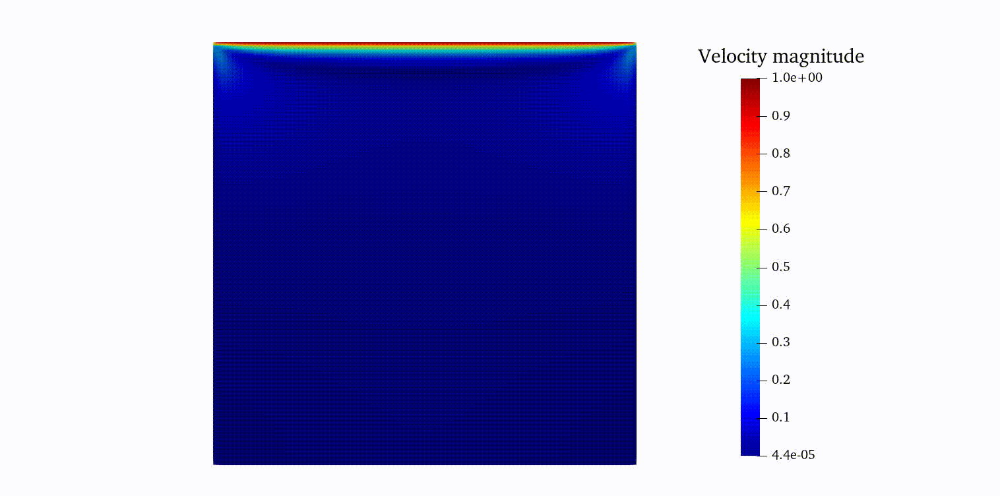

[`02thermalBlock`](https://github.com/ITHACA-FV/ITHACA-FV/tree/master/tutorials/CFD/02thermalBlock#tutorial-02): solve a parametrized POD-Galerkin ROM for a steady heat transfer case.

[`03steadyNS`](https://github.com/ITHACA-FV/ITHACA-FV/tree/master/tutorials/CFD/03steadyNS#tutorial-03): solve a POD-Galerkin ROM for a steady backstep flow with parametrized viscosity, using the supremizer approach.

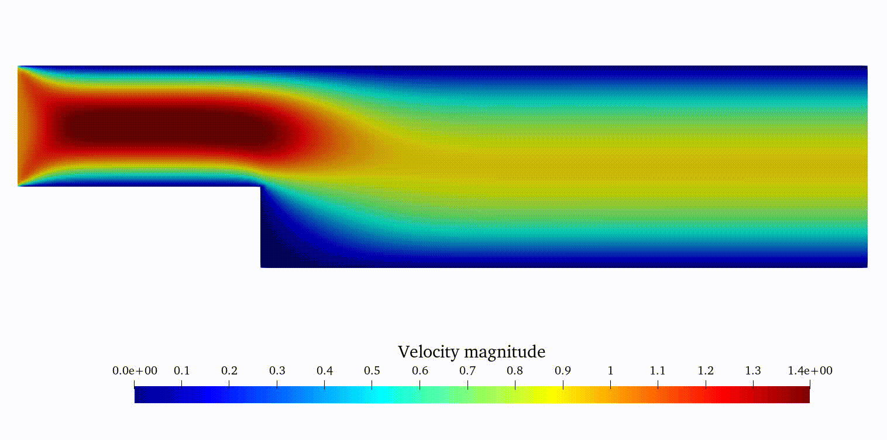

[`04unsteadyNS`](https://github.com/ITHACA-FV/ITHACA-FV/tree/master/tutorials/CFD/04unsteadyNS#tutorial-04): solve a POD-Galerkin ROM either with the supremizer or with the PPE approach, for the unsteady flow past a cylinder.

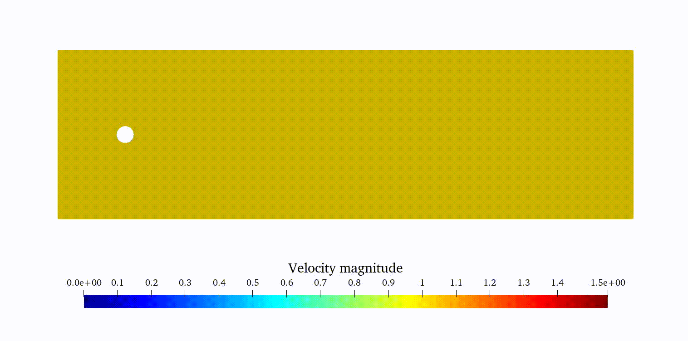

[`05PODI`](https://github.com/ITHACA-FV/ITHACA-FV/tree/master/tutorials/CFD/05PODI#tutorial-05): apply POD to the backstep test case.

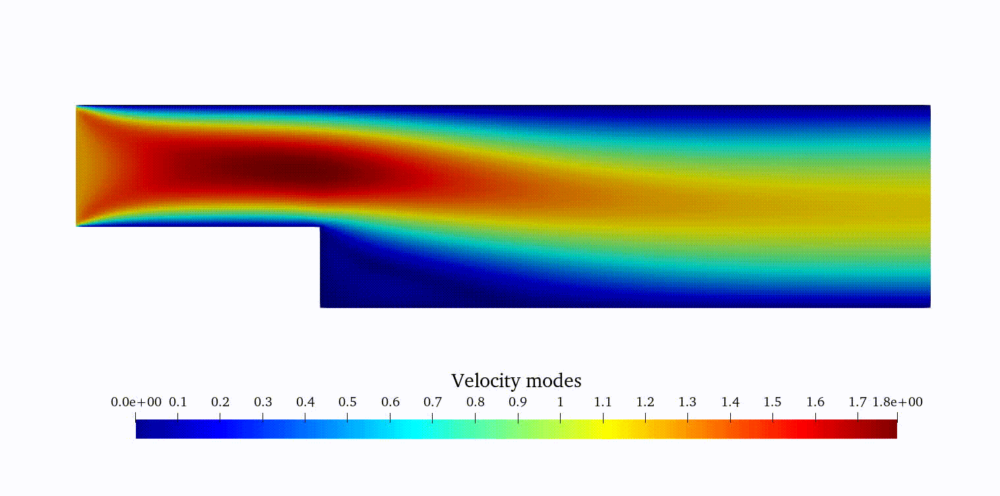

[`06POD_RBF`](https://github.com/ITHACA-FV/ITHACA-FV/tree/master/tutorials/CFD/06POD_RBF#tutorial-06): apply POD with RBF interpolation to the pitzdaily test case, with parametrized inlet velocity magnitude and orientation.

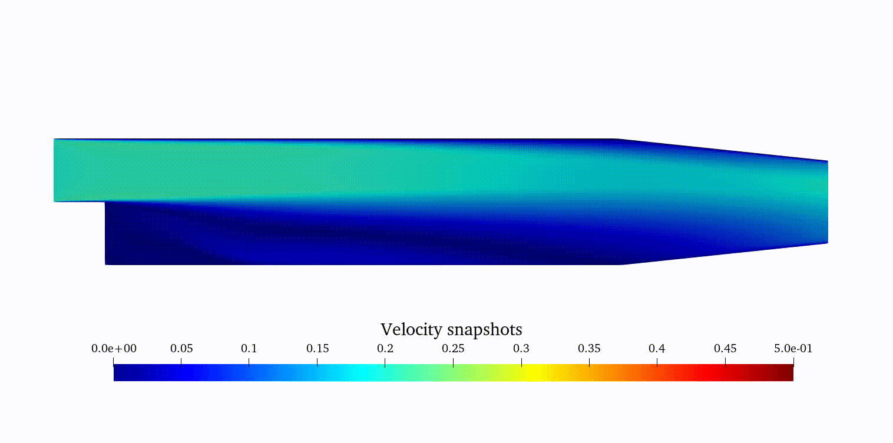

[`07NonIsothermalMixingElbow`](https://github.com/ITHACA-FV/ITHACA-FV/tree/master/tutorials/CFD/07NonIsothermalMixingElbow#tutorial-07): apply POD with RBF interpolation to the pitzdaily test case, with parametrized inlet velocity magnitude and orientation.

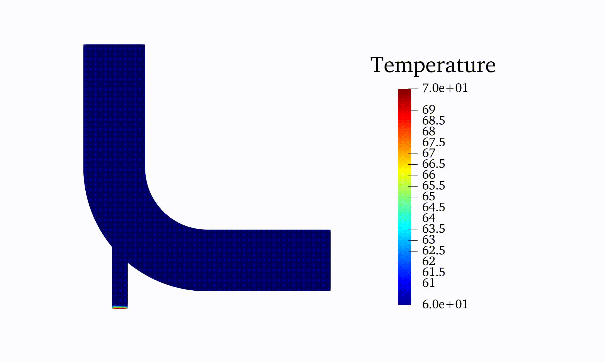

[`08DEIM`](https://github.com/ITHACA-FV/ITHACA-FV/tree/master/tutorials/CFD/08DEIM#tutorial-08): reconstruction of a parametric Gaussian function using the Discrete Empirical Interpolation Method (DEIM).

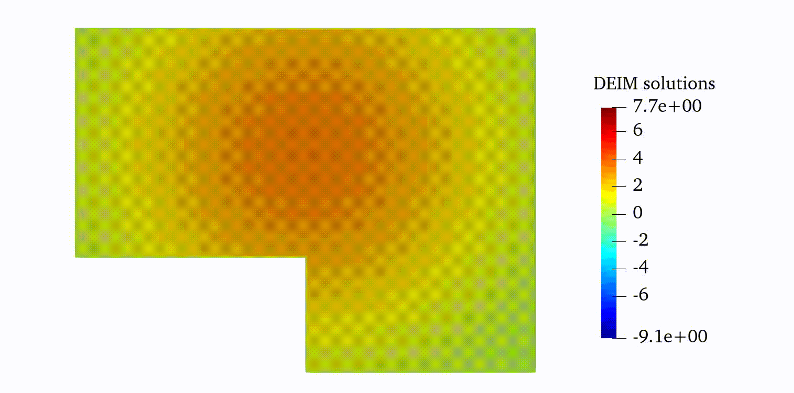

[`09DEIM_ROM`](https://github.com/ITHACA-FV/ITHACA-FV/tree/master/tutorials/CFD/09DEIM_ROM#tutorial-09): solves a parameterized heat-transfer problem and builds a reduced-order model using POD + DEIM.

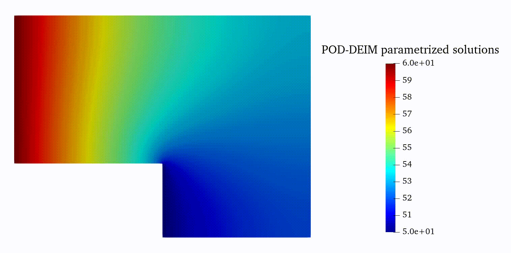

[`10unsteadyBB_enclosed`](https://github.com/ITHACA-FV/ITHACA-FV/tree/master/tutorials/CFD/10unsteadyBB_enclosed#tutorial-10): reduced order model for unsteady flow with prescribed heat flux in an enclosed domain.

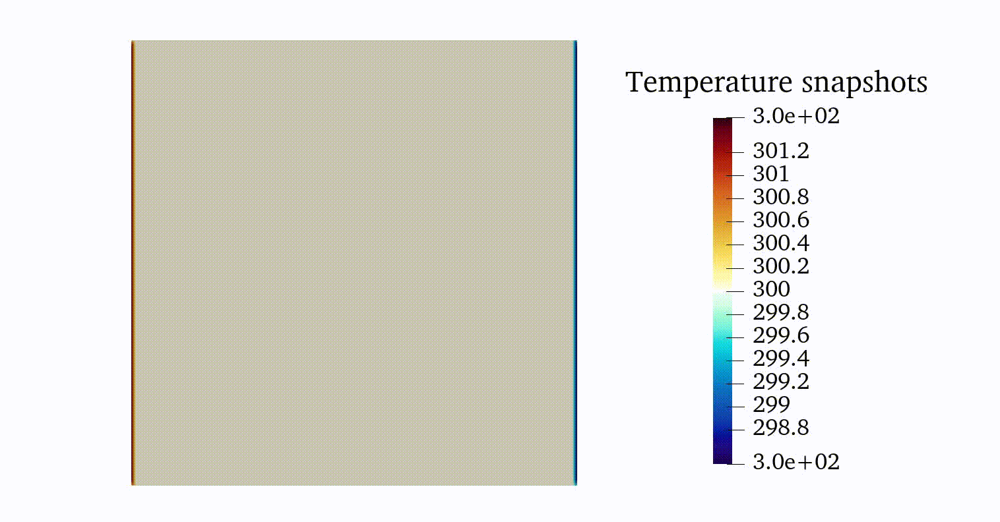

[`11UnsteadyBBOpen`](https://github.com/ITHACA-FV/ITHACA-FV/tree/master/tutorials/CFD/11UnsteadyBBOpen#tutorial-11): unsteady buoyancy-driven flow in an open domain using POD reduction.

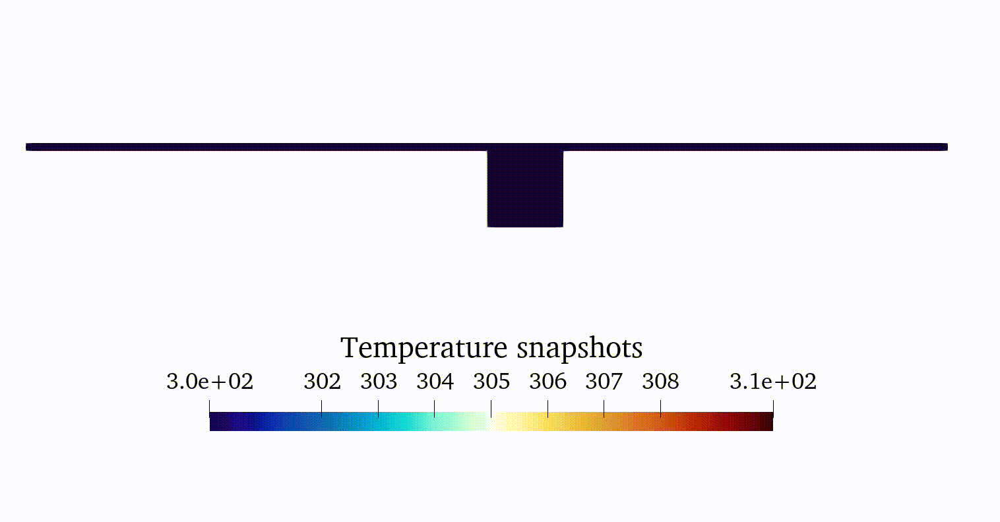

[`12simpleSteadyNS`](https://github.com/ITHACA-FV/ITHACA-FV/tree/master/tutorials/CFD/12simpleSteadyNS#tutorial-12): POD-Galerkin ROM for steady turbulent Navier-Stokes using the SIMPLE algorithm.

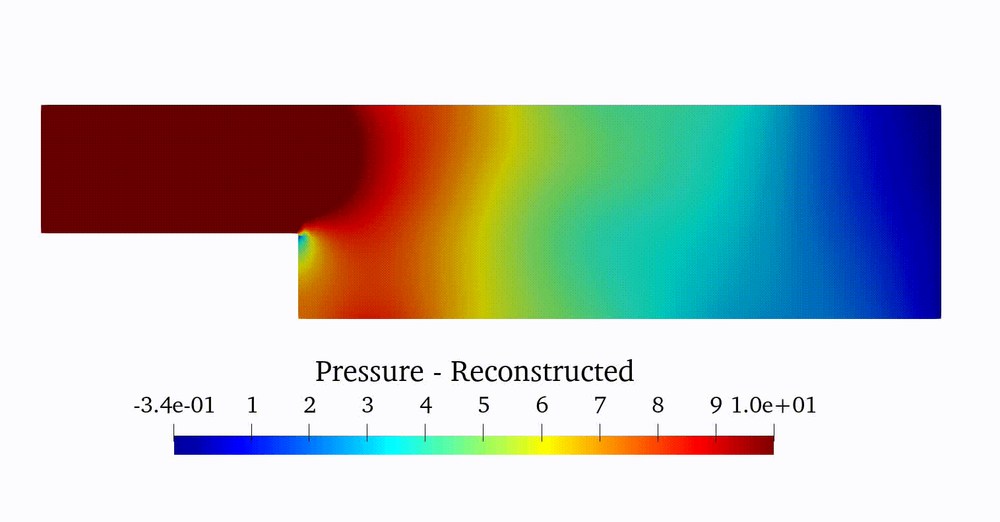

[`14DMDexample`](https://github.com/ITHACA-FV/ITHACA-FV/tree/master/tutorials/CFD/14DMDexample#tutorial-14): Dynamic Mode Decomposition applied to a transient flow problem.

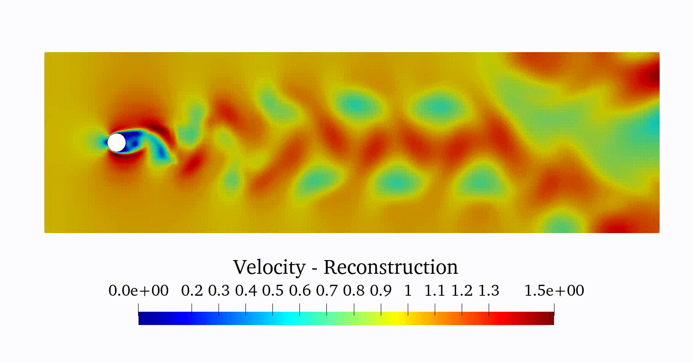

[`15MSR_cavity`](https://github.com/ITHACA-FV/ITHACA-FV/tree/master/tutorials/CFD/15MSR_cavity#tutorial-15): reduced order model for molten salt reactor cavity with parametrized diffusivity.

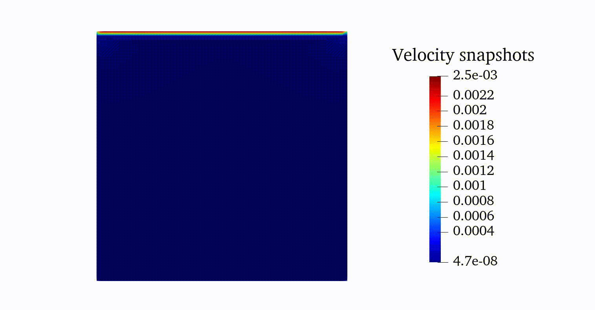

[`16MSR_FOMSA`](https://github.com/ITHACA-FV/ITHACA-FV/tree/master/tutorials/CFD/16MSR_FOMSA#tutorial-16): sensitivity analysis of molten salt reactor cavity parameters.

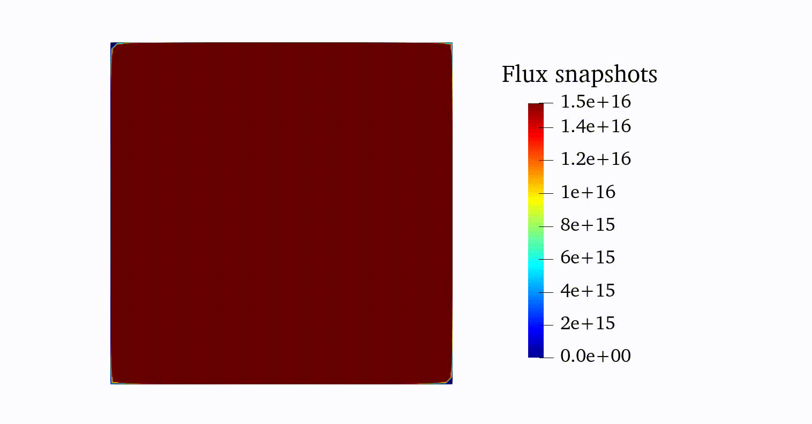

[`17YJunction`](https://github.com/ITHACA-FV/ITHACA-FV/tree/master/tutorials/CFD/17YJunction#tutorial-17): unsteady Navier-Stokes problem with time-dependent and parametrized boundary conditions in a Y-junction geometry.

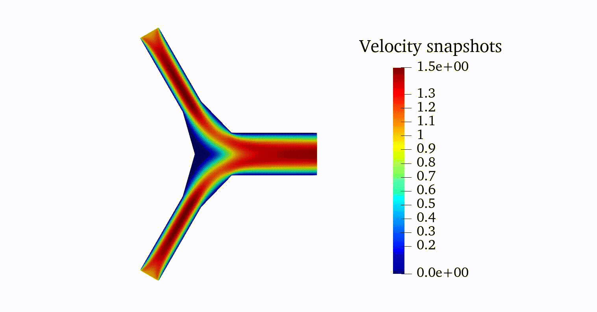

[`18simpleTurbNS`](https://github.com/ITHACA-FV/ITHACA-FV/tree/master/tutorials/CFD/18simpleTurbNS#tutorial-18): a steady-state backstep model with ROMs in turbulent regime.

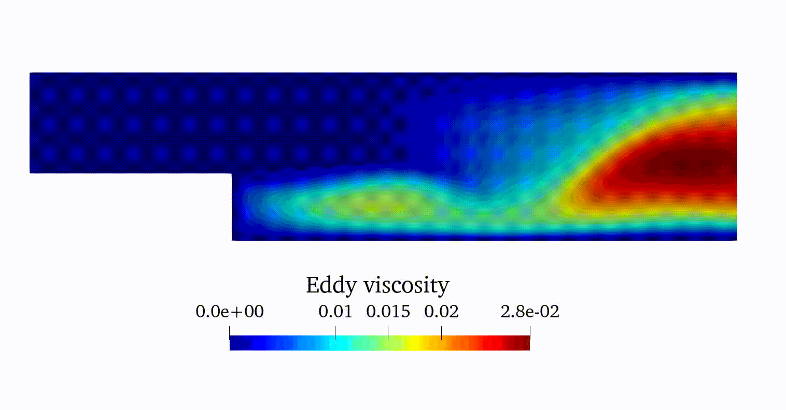

[`19UnsteadyNSExplicit`](https://github.com/ITHACA-FV/ITHACA-FV/tree/master/tutorials/CFD/19UnsteadyNSExplicit#tutorial-19): explicit time integration for POD-Galerkin ROM of lid-driven cavity.

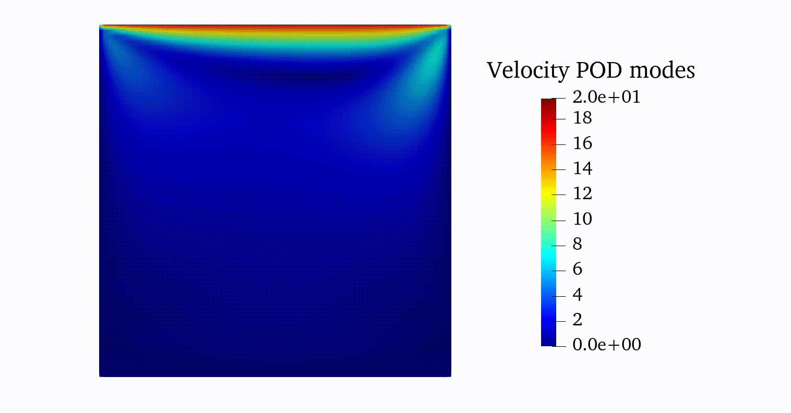

[`20incrementalPOD`](https://github.com/ITHACA-FV/ITHACA-FV/tree/master/tutorials/CFD/20incrementalPOD#tutorial-20): incremental POD algorithm for adaptive basis enrichment.

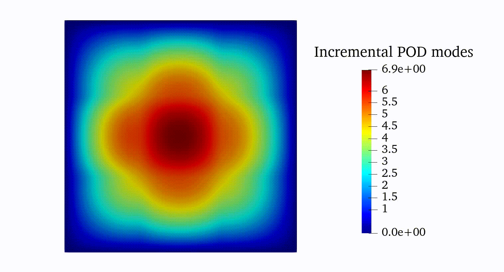

[`21unsteadyNSTurb_RBF`](https://github.com/ITHACA-FV/ITHACA-FV/tree/master/tutorials/CFD/21unsteadyNSTurb_RBF#tutorial-21): solving a reduced unsteady system with RBF interpolation for eddy viscosity coefficients, in the flow past a cylinder test case.

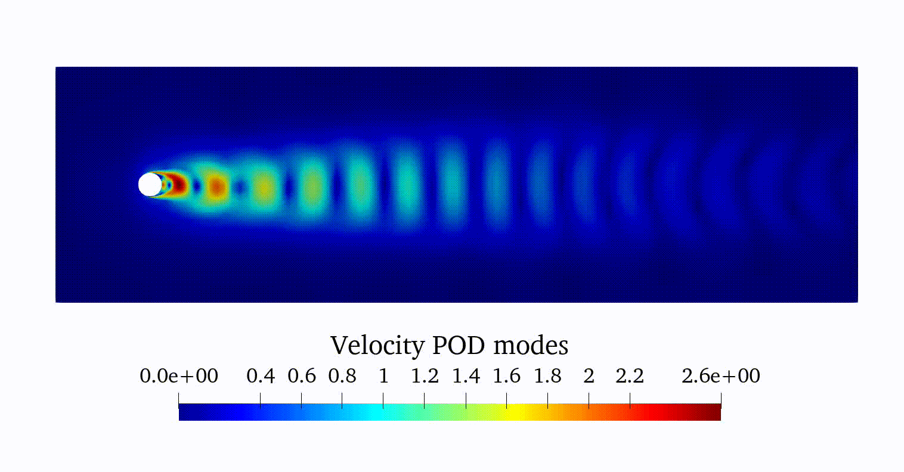

[`22datadriven_corrections`](https://github.com/ITHACA-FV/ITHACA-FV/tree/master/tutorials/CFD/22datadriven_corrections#tutorial-22): data-driven pressure POD corrections for improved ROM accuracy on the flow past a cylinder case.

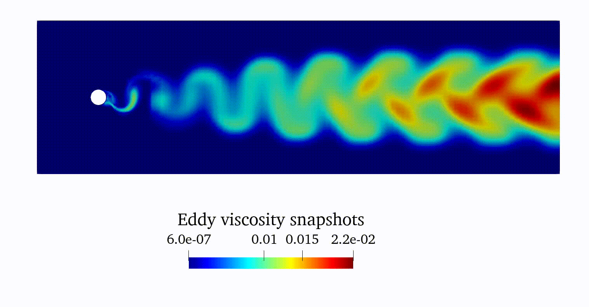

[`23burgers`](https://github.com/ITHACA-FV/ITHACA-FV/tree/master/tutorials/CFD/23burgers#tutorial-23): solving a Burgers problem in a backstep domain, and apply POD.

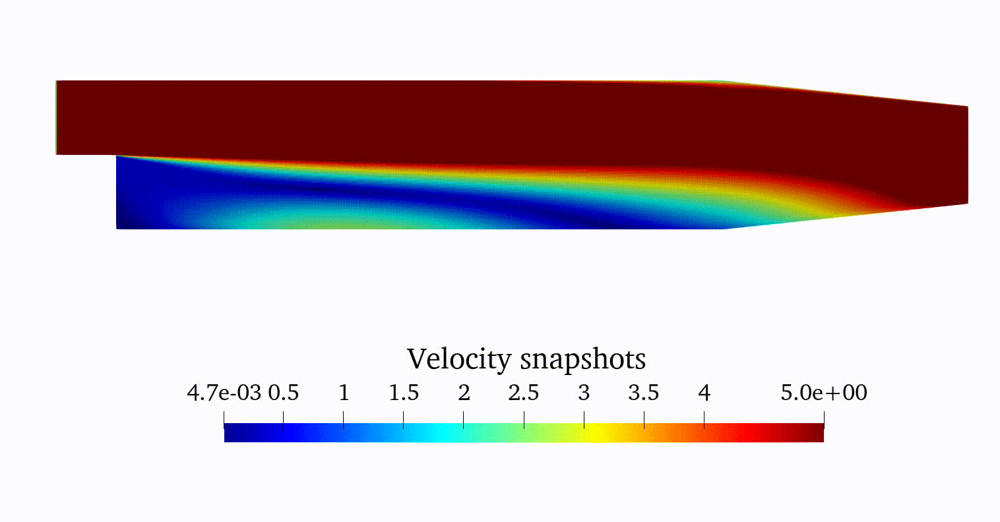

[`24HyperReduction`](https://github.com/ITHACA-FV/ITHACA-FV/tree/master/tutorials/CFD/24HyperReduction#tutorial-24): POD with hyper-reduction techniques (DEIM, gappy POD).

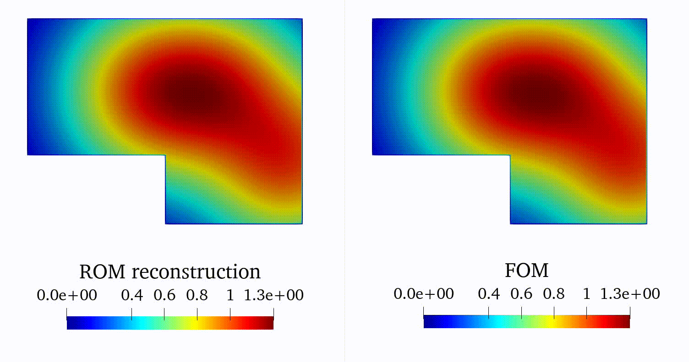

[`25Moving_Cylinder`](https://github.com/ITHACA-FV/ITHACA-FV/tree/master/tutorials/CFD/25Moving_Cylinder#tutorial-25): reduced order model for flow around a moving cylinder.

[`26MovingAirfoil`](https://github.com/ITHACA-FV/ITHACA-FV/tree/master/tutorials/CFD/26MovingAirfoil#tutorial-26): POD-based ROM for flow around a moving airfoil.

[`27SmagorinskyHyperreduction`](https://github.com/ITHACA-FV/ITHACA-FV/tree/master/tutorials/CFD/27SmagorinskyHyperreduction#tutorial-27): Smagorinsky model with hyper-reduction for LES ROM.

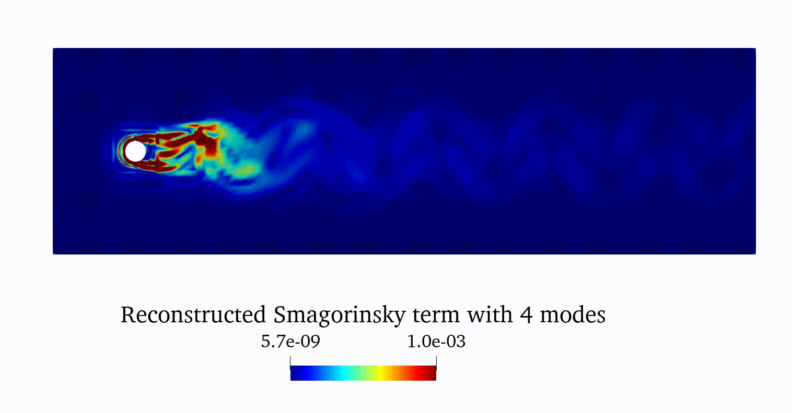

### Examples related to machine learning (**NN** folder)

[`01simpleTurbGeomClosed`](https://github.com/ITHACA-FV/ITHACA-FV/tree/master/tutorials/NN/01simpleTurbGeomClosed#tutorial-nn-01): neural network closure for steady turbulent flow in a closed geometry.

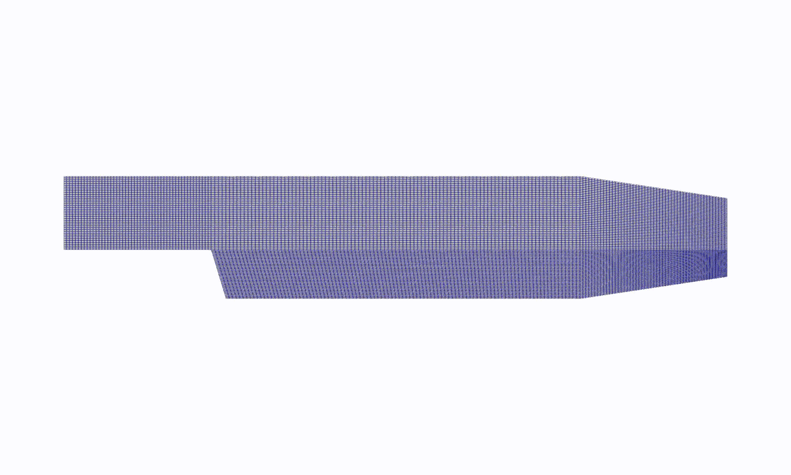

[`BumpCompressibleSteadyNS`](https://github.com/ITHACA-FV/ITHACA-FV/tree/master/tutorials/NN/BumpCompressibleSteadyNS#tutorial-nn-02): neural network reduced model for compressible flow over a bump.

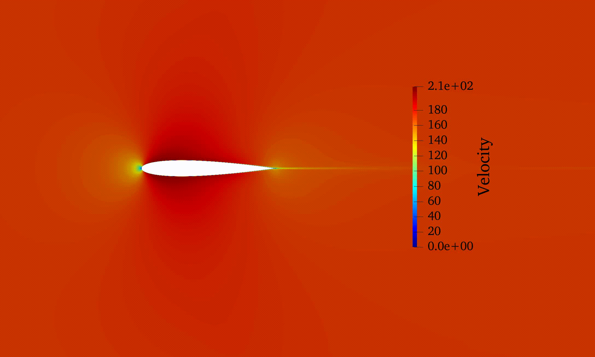

[`CompressibleSteadyNS`](https://github.com/ITHACA-FV/ITHACA-FV/tree/master/tutorials/NN/CompressibleSteadyNS#tutorial-nn-03): neural network reduced model for compressible steady Navier-Stokes.

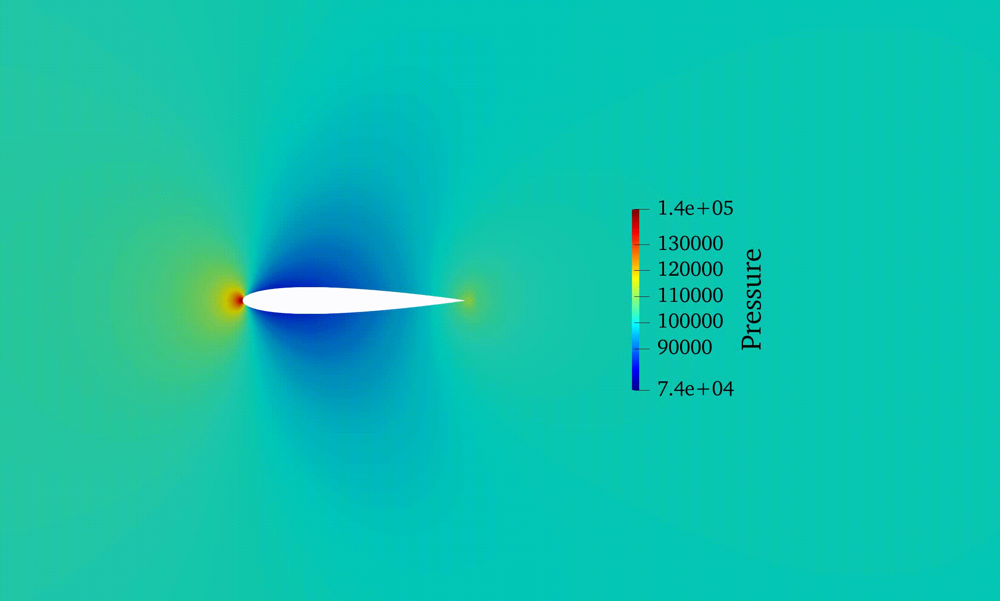

### Examples related to **UQ**

[`01enKF`](https://github.com/ITHACA-FV/ITHACA-FV/tree/master/tutorials/UQ/01enKF#tutorial-uq-01): ensemble Kalman filter applied to a linear dynamical system.

[`02enKF_1DinverseHeatTransfer`](https://github.com/ITHACA-FV/ITHACA-FV/tree/master/tutorials/UQ/02enKF_1DinverseHeatTransfer#tutorial-uq-02): state reconstruction in 1D heat transfer using ensemble Kalman filter.

### Examples related to **Inverse Heat Transfer**

[`IHTP01inverseLaplacian`](https://github.com/ITHACA-FV/ITHACA-FV/tree/master/tutorials/inverseHeatTransfer/IHTP01inverseLaplacian#tutorial-ihtp-01): inverse heat transfer problem using regularization (CG) and RBF parametrization methods.

