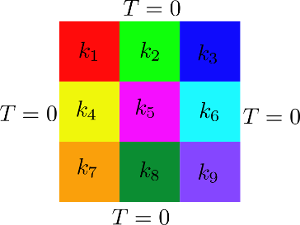
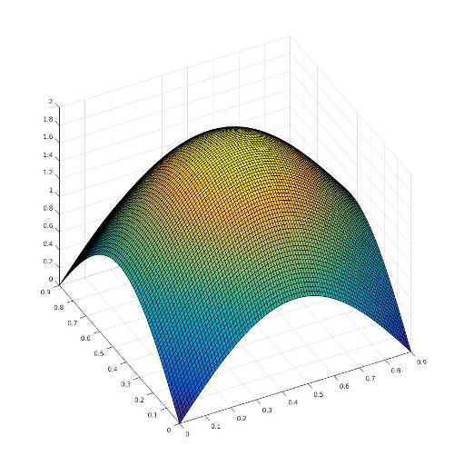

# Tutorial 02
## Implementation of a tutorial of a steady heat transfer problem

The problem consists of a parametrized POD-Galerkin ROM for a steady heat transfer phenomenon. The parametrization is on the diffusivity constant. The OpenFOAM full order problem is based on **laplacianFoam**.
The problem equation is

$$\nabla \cdot (k \nabla T) = S,$$

where $k$ <!--!$k$--> is the diffusivity, $T$ is the temperature and $S$ is the source term. The problem discretised and formalized in matrix equation reads:

$$AT = S,$$

where $A$ is the matrix of interpolation coefficients, $T$  is the vector of unknowns and $S$ is the vector representing the source term. The domain is subdivided in 9 different parts and each part has parametrized diffusivity. See the image below for a clarification.



Both the full order and the reduced order problem are solved exploiting the parametric affine decomposition of the differential operators:

$$A = \sum_{i=1}^N \theta_i(\mu) A_i.$$

For the operations performed by each command check the comments in the source [**02thermalBlock.C**](https://github.com/ITHACA-FV/ITHACA-FV/blob/master/tutorials/CFD/02thermalBlock/02thermalBlock.C) file.

# A look into the code
In this section are explained the main steps necessary to construct the tutorial N°2.

## The necessary header files

First of all let's have a look to the header files that needs to be included and what they are responsible for:

The standard C++ header for input/output stream objects:
```cpp
    #include <iostream>
```
The OpenFOAM header files:
```cpp
    #include "fvCFD.H"
    #include "IOmanip.H"
    #include "Time.H"
```
The header file of ITHACA-FV necessary for this tutorial
```cpp
    #include "ITHACAPOD.H"
    #include "ITHACAutilities.H"
```
The [**Eigen**](https://ITHACA-FV.github.io/ITHACA-FV/namespaceEigen.html) library for matrix manipulation and linear and non-linear algebra operations:
```cpp
    #include <Eigen/Dense>
```
Then we can define the tutorial02 class as a child of the laplacianProblem class:
```cpp
    #define _USE_MATH_DEFINES
    #include <cmath>
```
## Implementation of the tutorial02 class

We can define the [**tutorial02**](https://ITHACA-FV.github.io/ITHACA-FV/classtutorial02.html) class as a child of the [**laplacianProblem**](https://ITHACA-FV.github.io/ITHACA-FV/classlaplacianProblem.html) class
```cpp
    class tutorial02: public laplacianProblem
    {
        public:
            explicit tutorial02(int argc, char* argv[])
                :
                laplacianProblem(argc, argv),
                T(_T()),
                nu(_nu()),
                S(_S())
            {}
```
The members of the class are the fields that need to be manipulated during the resolution of the problem

Inside the class it is defined the offline solve method according to the specific parametrized problem that needs to be solved.

```cpp
    void offlineSolve(word folder = "./ITHACAoutput/Offline/")
        {
```
If the offline solve has already been performed, then read the existing snapshots:

```cpp
    if (offline)
    {
        ITHACAstream::read_fields(Tfield, "T", folder);
        mu_samples =
            ITHACAstream::readMatrix(folder + "/mu_samples_mat.txt");
    }
```
Else, perform the offline solve where a loop over all the parameters is performed:
```cpp
    for (label i = 0; i < mu.rows(); i++)
    {
        for (label j = 0; j < mu.cols() ; j++)
        {
            mu_now[i] =  mu(i, j);
            theta[j] = mu(i, j);
        }
```
A 0 internal constant value is assigned before each solve command with the line:
```cpp
        assignIF(T, IF);
```
The solve operation is then performed. See also the [**laplacianProblem**](https://ITHACA-FV.github.io/ITHACA-FV/classlaplacianProblem.html) class for the definition of the methods
```cpp
    truthSolve(mu_now, folder);
```
We need also to implement a method to set/define the source term that may be problem-dependent. In this case the source term is defined with a hat function:
```cpp
    void SetSource()
    {
        volScalarField yPos = T.mesh().C().component(vector::Y);
        volScalarField xPos = T.mesh().C().component(vector::X);
        forAll(S, counter)
        {
            S[counter] = Foam::sin(xPos[counter] / 0.9 * M_PI) + Foam::sin(
                                yPos[counter] / 0.9 * M_PI);
        }
    }
```
The source term is here defined as:

$$S = \sin \left(\frac{\pi}{L}\cdot x \right) + \sin \left(\frac{\pi}{L}\cdot y \right),$$

where $L$ is the dimension of the thermal block which is equal to 0.9.
The source term appears as follows.



With the following is defined a method to set the parameter of the affine expansion:
```cpp
    void compute_nu()
    {
```
The list of parameters is resized according to the number of parametrized regions
```cpp
        nu_list.resize(9);
```
The nine different `volScalarFields` to identify the viscosity in each domain are initialized:
```cpp
        volScalarField nu1(nu);
        volScalarField nu2(nu);
        volScalarField nu3(nu);
        volScalarField nu4(nu);
        volScalarField nu5(nu);
        volScalarField nu6(nu);
        volScalarField nu7(nu);
        volScalarField nu8(nu);
        volScalarField nu9(nu);
```
and the 9 different boxes are defined:
```cpp
        Eigen::MatrixXd Box1(2, 3);
        Box1 << 0, 0, 0, 0.3, 0.3, 0.1;
        Eigen::MatrixXd Box2(2, 3);
        Box2 << 0.3, 0, 0, 0.6, 0.3, 0.1;
        Eigen::MatrixXd Box3(2, 3);
        Box3 << 0.6, 0, 0, 0.91, 0.3, 0.1;
        Eigen::MatrixXd Box4(2, 3);
        Box4 << 0, 0.3, 0, 0.3, 0.6, 0.1;
        Eigen::MatrixXd Box5(2, 3);
        Box5 << 0.3, 0.3, 0, 0.6, 0.6, 0.1;
        Eigen::MatrixXd Box6(2, 3);
        Box6 << 0.6, 0.3, 0, 0.91, 0.6, 0.1;
        Eigen::MatrixXd Box7(2, 3);
        Box7 << 0, 0.6, 0, 0.3, 0.91, 0.1;
        Eigen::MatrixXd Box8(2, 3);
        Box8 << 0.3, 0.61, 0, 0.6, 0.91, 0.1;
        Eigen::MatrixXd Box9(2, 3);
        Box9 << 0.6, 0.6, 0, 0.9, 0.91, 0.1;
```
and for each of the defined boxes, the relative diffusivity field is set to 1 inside the box and remains 0 elsewhere:
```cpp
        ITHACAutilities::setBoxToValue(nu1, Box1, 1.0);
        ITHACAutilities::setBoxToValue(nu2, Box2, 1.0);
        ITHACAutilities::setBoxToValue(nu3, Box3, 1.0);
        ITHACAutilities::setBoxToValue(nu4, Box4, 1.0);
        ITHACAutilities::setBoxToValue(nu5, Box5, 1.0);
        ITHACAutilities::setBoxToValue(nu6, Box6, 1.0);
        ITHACAutilities::setBoxToValue(nu7, Box7, 1.0);
        ITHACAutilities::setBoxToValue(nu8, Box8, 1.0);
        ITHACAutilities::setBoxToValue(nu9, Box9, 1.0);
```
See also the [**ITHACAutilities::setBoxToValue**](https://ITHACA-FV.github.io/ITHACA-FV/namespaceITHACAutilities.html) for more details.

The list of diffusivity fields is set with:
```cpp
        nu_list.set(0, (nu1).clone());
        nu_list.set(1, (nu2).clone());
        nu_list.set(2, (nu3).clone());
        nu_list.set(3, (nu4).clone());
        nu_list.set(4, (nu5).clone());
        nu_list.set(5, (nu6).clone());
        nu_list.set(6, (nu7).clone());
        nu_list.set(7, (nu8).clone());
        nu_list.set(8, (nu9).clone());
    }
```
## Definition of the main function

Once the [**tutorial02**](https://ITHACA-FV.github.io/ITHACA-FV/classtutorial02.html) class is defined, we need to define the main function, namely an example of type tutorial02 is constructed:
```cpp
    tutorial02 example(argc, argv);
```
along with another instance to compute the test set:
```cpp
    tutorial02 FOM_test(argc, argv);
```
The problem is split in *offline* and *online* stages:

```cpp
    if (example._args().get("stage").match("offline"))
    {
        // perform the offline stage, extracting the modes from the snapshots'
        // dataset corresponding to parOffline
        offline_stage(example, FOM_test);
    }
    else if (example._args().get("stage").match("online"))
    {
        // load precomputed modes and reduced matrices
        offline_stage(example, FOM_test);
        // perform online solve with respect to the parameters in parOnline
        online_stage(example, FOM_test);
    }
    else
    {
        std::cout << "Pass '-stage offline', '-stage online'" << std::endl;
    }
```

## Offline stage

The number of parameters is set:
```cpp
    example.Pnumber = 9;
    example.setParameters();
```
The range of the parameters is defined:
```cpp
    example.mu_range.col(0) = Eigen::MatrixXd::Ones(9, 1) * 0.001;
    example.mu_range.col(1) = Eigen::MatrixXd::Ones(9, 1) * 0.1;
```
and 500 random combinations of the parameters are generated:
```cpp
    example.genRandPar(500);
```
The size of the list of values that are multiplying the affine forms is set:
```cpp
    example.theta.resize(9);
```
The source term is defined, the `compute_nu` and `assemble_operator` functions are called
```cpp
    example.SetSource();
    example.compute_nu();
    example.assemble_operator();
```
then the Offline full-order solve is performed:
```cpp
    example.offlineSolve();
```
Once the Offline solve is performed, the modes are obtained using the `ITHACAPOD::getModes` function:
```cpp
    ITHACAPOD::getModes(example.Tfield, example.Tmodes, example._T().name(),
                        example.podex, 0, 0,
                        NmodesTout);
```
and the projection is performed onto the POD modes using 10 modes:
```cpp
    example.project(NmodesTproj);
```
## Online stage

Once the projection is performed, we can construct a reduced object:
```cpp
    reducedLaplacian reduced(example);
```
and solve the reduced problem for some values of the parameters:
```cpp
    for (int i = 0; i < FOM_test.mu.rows(); i++)
    {
        reduced.solveOnline(FOM_test.mu.row(i));
    }
```
Finally, once the online solve has been performed, we can reconstruct the solution:
```cpp
    reduced.reconstruct("./ITHACAoutput/Reconstruction");
```
## Parallel run

To speed up the offline stage, ITHACA-FV employs OpenFOAM facilities to run
applications in parallel on distributed processors: the method of parallel
computing used by OpenFOAM is known as domain decomposition.

First, the domain is decomposed in 4 subdomains as indicated in the directory
*system/decomposeParDict* with the command:
```
    decomposePar
```
Then, the offline solve is performed in parallel, evaluating the modes and the
reduced matrices on the whole domain
```
    mpirun -np 4 02thermalBlock -stage offline -parallel
```
The online stage is performed analogously
```
    mpirun -np 4 02thermalBlock -stage online -parallel
```
The users can simply run the script `Allrun_parallel`.

The plain code can be found [here](https://raw.githubusercontent.com/ITHACA-FV/ITHACA-FV/refs/heads/master/tutorials/CFD/02thermalBlock/02thermalBlock.C).