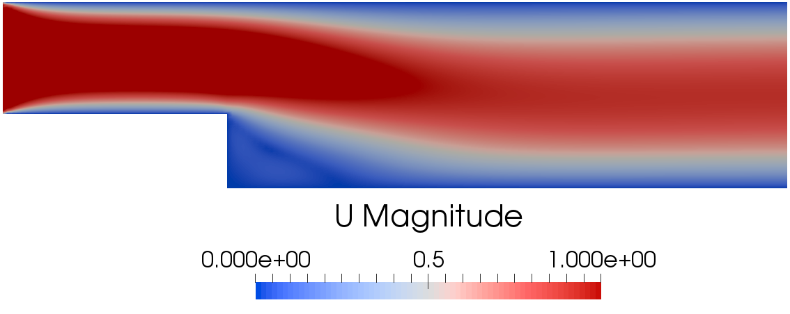

# Introduction to tutorial 3

The problems consists of steady Navier-Stokes problem with parametrized
viscosity. The physical problem is the backward facing step depicted in the
following image:

At the inlet a uniform and constant velocity equal to 1 m/s is prescribed.

## The necessary header files

First of all let's have a look to the header files that needs to be included and what they are responsible for.

The header files of ITHACA-FV necessary for this tutorial

    #include "steadyNS.H"
    #include "ITHACAstream.H"
    #include "ITHACAPOD.H"
    #include "ReducedSteadyNS.H"
    #include "forces.H"
    #include "IOmanip.H"

## Implementation of the tutorial03 class

We can define the tutorial03 class as a child of the steadyNS class

    class tutorial03 : public steadyNS

The members of the class are the fields that need to be manipulated during the resolution of the problem.

    volVectorField& U;
    volScalarField& p;

Inside the class it is defined the offlineSolve method according to the specific parametrized problem that needs to be solved.

    void offlineSolve()

If the offline solve has already been performed than read the existing snapshots

    if (offline)
    {
        ITHACAstream::read_fields(Ufield, U, "./ITHACAoutput/Offline/");
        ITHACAstream::read_fields(Pfield, p, "./ITHACAoutput/Offline/");
        mu_samples = ITHACAstream::readMatrix("./ITHACAoutput/Offline/mu_samples_mat.txt");
    }

else perform the offline solve where a loop over all the parameters is performed:

    Vector<double> Uinl(0, 0, 0);
    for (label i = 0; i < mu.cols(); i++)
    {
        mu_now[0] = mu(0, i);
        change_viscosity(mu(0, i));
        truthSolve(mu_now);
        restart();
    }

See also the steadyNS class for the definition of the methods.

## Definition of the main function

This tutorial is divided into Offline and Online stage

    if (example._args().get("stage").match("offline"))
    {
        // perform the offline stage, extracting the modes from the snapshots'
        // dataset corresponding to parOffline
        offline_stage(example);
    }
    else if (example._args().get("stage").match("online"))
    {
        // load precomputed modes and reduced matrices
        offline_stage(example);
        // perform online solve with respect to the parameters in parOnline
        online_stage(example);
    }
    else
    {
        std::cout << "Pass '-stage offline', '-stage online'" << std::endl;
    }

pass "Offline" or "Online" as arguments from the command line:

    > 03steadyNS -offline
    > 03steadyNS -online

An example of type tutorial03 is constructed:

    tutorial03 example(argc, argv);

## Offline stage

The inlet boundary is set:

    example.inletIndex.resize(1, 2);
    example.inletIndex(0, 0) = 0;
    example.inletIndex(0, 1) = 0;

and the offline stage is performed:

    example.offlineSolve();

and the supremizer problem is solved:

    example.solvesupremizer();

In order to show the functionality of reading fields in this case the lifting function is read from a precomputed simulation with a unitary inlet velocity:

    ITHACAstream::read_fields(example.liftfield, example.U, "./lift/");
    ITHACAutilities::normalizeFields(example.liftfield);

Then the snapshots matrix is homogenized:

    example.computeLift(example.Ufield, example.liftfield, example.Uomfield);

and the modes for velocity, pressure and supremizers are obtained:

    ITHACAPOD::getModes(example.Ufield, example.Umodes, example._U().name(),
                            example.podex, 0, 0, NmodesUout);
    ITHACAPOD::getModes(example.Pfield, example.Pmodes, example._p().name(),
                        example.podex, 0, 0,
                        NmodesPout);
    ITHACAPOD::getModes(example.supfield, example.supmodes, example._U().name(),
                        example.podex,
                        example.supex, 1, NmodesSUPout);

then the projection onto the POD modes is performed with:

    example.projectSUP("./Matrices", NmodesUproj, NmodesPproj, NmodesSUPproj);

## Online stage

The modes and reduced matrices computed during the offline stage are loaded

    offline_stage(example);

The reduced object is constructed:

    reducedSteadyNS ridotto(example);

and the online solve is performed for some values of the viscosity:

    word filename("./parOnline");
    example.mu = ITHACAstream::readMatrix(filename);

The vel_now matrix in this case is not used since there are no parametrized boundary conditions.

The viscosity is set with the command:

    ridotto.nu = example.mu(k,0)

finally the online solution stored during the online solve is exported to file in three different formats with the lines:

    ITHACAstream::exportMatrix(ridotto.online_solution, "red_coeff", "python",
                               "./ITHACAoutput/red_coeff");
    ITHACAstream::exportMatrix(ridotto.online_solution, "red_coeff", "matlab",
                               "./ITHACAoutput/red_coeff");
    ITHACAstream::exportMatrix(ridotto.online_solution, "red_coeff", "eigen",
                               "./ITHACAoutput/red_coeff");

and the online solution is reconstructed and exported to file

    ridotto.reconstruct(true, "./ITHACAoutput/Reconstruction/");

## Parallel run

To speed up the offline stage, ITHACA-FV employs OpenFOAM facilities to run
applications in parallel on distributed processors: the method of parallel
computing used by OpenFOAM is known as domain decomposition.

First, the domain is decomposed as indicated in the directory
*system/decomposeParDict*, with the command

    decomposePar

In the parallel run also the lift field needs to be split with

    decomposePar -time 0,1

Then, the offline solve is performed in parallel, evaluating the modes and the
reduced matrices on the whole domain

    mpirun -np 4 -quiet 03steadyNS -parallel -stage offline

The online stage is performed analogously

    mpirun -np 4 -quiet 03steadyNS -parallel -stage online

In the case of OF1812 the parallel run is not supported.
