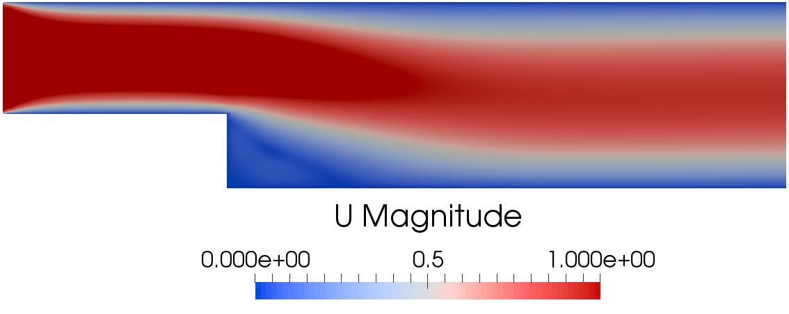

# Tutorial 03
## Introduction 
The problem consists of steady Navier-Stokes problem with parametrized
viscosity. The physical problem is the backward facing step depicted in the
following image:



At the inlet a uniform and constant velocity equal to 1 m/s is prescribed.

# A detailed look into the code
In this section are explained the main steps necessary to construct the tutorial N°3.

## The necessary header files

First of all let's have a look to the header files that need to be included and what they are responsible for.

The header files of ITHACA-FV necessary for this tutorial are the following:
```cpp
    #include "steadyNS.H"
    #include "ITHACAstream.H"
    #include "ITHACAPOD.H"
    #include "ReducedSteadyNS.H"
    #include "forces.H"
    #include "IOmanip.H"
```
## Implementation of the tutorial03 class

We can define the tutorial03 class as a child of the steadyNS class
```cpp
    class tutorial03 : public steadyNS
```
The members of the class are the fields that need to be manipulated during the resolution of the problem.
```cpp
    volVectorField& U;
    volScalarField& p;
```
Inside the class it is defined the `offlineSolve` method according to the specific parametrized problem that needs to be solved.
```cpp
    void offlineSolve()
```
If the offline solve has already been performed, then read the existing snapshots:
```cpp
    if (offline)
    {
        ITHACAstream::read_fields(Ufield, U, "./ITHACAoutput/Offline/");
        ITHACAstream::read_fields(Pfield, p, "./ITHACAoutput/Offline/");
        mu_samples = ITHACAstream::readMatrix("./ITHACAoutput/Offline/mu_samples_mat.txt");
    }
```
Else, perform the offline solve, which consists of a loop over all the parameters:
```cpp
    Vector<double> Uinl(0, 0, 0);
    for (label i = 0; i < mu.cols(); i++)
    {
        mu_now[0] = mu(0, i);
        change_viscosity(mu(0, i));
        truthSolve(mu_now);
        restart();
    }
```
See also the [**steadyNS**](https://ithaca-fv.github.io/ITHACA-FV/steadyNS_8C.html) class for the definition of the methods.

## Definition of the main function

This tutorial is divided into Offline and Online stage, as can be seen from the main:
```cpp
    if (example._args().get("stage").match("offline"))
    {
        // perform the offline stage, extracting the modes from the snapshots'
        // dataset corresponding to parOffline
        offline_stage(example);
    }
    else if (example._args().get("stage").match("online"))
    {
        // load precomputed modes and reduced matrices
        offline_stage(example);
        // perform online solve with respect to the parameters in parOnline
        online_stage(example);
    }
    else
    {
        std::cout << "Pass '-stage offline', '-stage online'" << std::endl;
    }
```
Pass "Offline" or "Online" as arguments from the command line  to run either the offline or the online stage:
```cpp
    > 03steadyNS -offline
    > 03steadyNS -online
```
An example of type tutorial03 is constructed here:
```cpp
    tutorial03 example(argc, argv);
```
## Offline stage

The inlet boundary is initially set:
```cpp
    example.inletIndex.resize(1, 2);
    example.inletIndex(0, 0) = 0;
    example.inletIndex(0, 1) = 0;
```
and the offline stage is performed:
```cpp
    example.offlineSolve();
```
Then, the supremizer problem is solved:
```cpp
    example.solvesupremizer();
```
In order to show the functionality of reading fields, in this case the lifting function is read from a precomputed simulation with a unitary inlet velocity:
```cpp
    ITHACAstream::read_fields(example.liftfield, example.U, "./lift/");
    ITHACAutilities::normalizeFields(example.liftfield);
```
Then the snapshots matrix is homogenized:
```cpp
    example.computeLift(example.Ufield, example.liftfield, example.Uomfield);
```
and the modes for velocity, pressure and supremizers are obtained:
```cpp
    ITHACAPOD::getModes(example.Ufield, example.Umodes, example._U().name(),
                            example.podex, 0, 0, NmodesUout);
    ITHACAPOD::getModes(example.Pfield, example.Pmodes, example._p().name(),
                        example.podex, 0, 0,
                        NmodesPout);
    ITHACAPOD::getModes(example.supfield, example.supmodes, example._U().name(),
                        example.podex,
                        example.supex, 1, NmodesSUPout);
```
Then, the projection onto the POD modes is performed with:
```cpp
    example.projectSUP("./Matrices", NmodesUproj, NmodesPproj, NmodesSUPproj);
```
## Online stage

The modes and reduced matrices computed during the offline stage are loaded
```cpp
    offline_stage(example);
```
The reduced object is constructed:
```cpp
    reducedSteadyNS reduced(example);
```
and the online solve is performed for some values of the viscosity:
```cpp
    word filename("./parOnline");
    example.mu = ITHACAstream::readMatrix(filename);
```
The `vel_now` matrix in this case is not used since there are no parametrized boundary conditions.

The viscosity is set with the command:
```cpp
    reduced.nu = example.mu(k, 0)
```
Finally, the online solution stored during the online solve is exported to file in three different formats with the lines:
```cpp
    ITHACAstream::exportMatrix(reduced.online_solution, "red_coeff", "python",
                               "./ITHACAoutput/red_coeff");
    ITHACAstream::exportMatrix(reduced.online_solution, "red_coeff", "matlab",
                               "./ITHACAoutput/red_coeff");
    ITHACAstream::exportMatrix(reduced.online_solution, "red_coeff", "eigen",
                               "./ITHACAoutput/red_coeff");
```
and the online solution is reconstructed and exported to file:
```cpp
    reduced.reconstruct(true, "./ITHACAoutput/Reconstruction/");
```

## Parallel run

To speed up the offline stage, ITHACA-FV employs OpenFOAM facilities to run
applications in parallel on distributed processors: the method of parallel
computing used by OpenFOAM is known as domain decomposition.

First, the domain is decomposed as indicated in the directory
*system/decomposeParDict*, with the command
```
    decomposePar
```
In the parallel run also the lift field needs to be split with
```
    decomposePar -case lift -time 0,1
```
Then, the offline solve is performed in parallel, evaluating the modes and the
reduced matrices on the whole domain
```
    mpirun -np 4 -quiet 03steadyNS -parallel -stage offline
```
The online stage is performed analogously
```
    mpirun -np 4 -quiet 03steadyNS -parallel -stage online
```
To run the tutorial in parallel, the users can simple run the script `Allrun_parallel`.

In the case of OF1812, the parallel run is not supported.

The plain code can be found [here](https://raw.githubusercontent.com/ITHACA-FV/ITHACA-FV/refs/heads/master/tutorials/CFD/03steadyNS/03steadyNS.C).