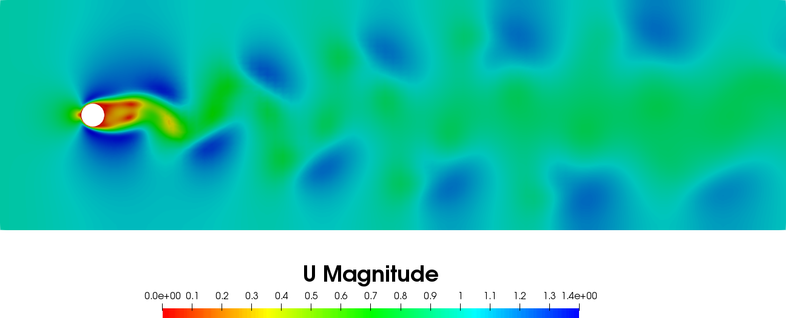

# Tutorial 04
## Introduction

In this tutorial we implement a parametrized unsteady Navier-Stokes 2D problem where the parameter is the kinematic viscosity.
The physical problem represents an incompressible flow passing around a very long cylinder. The simulation domain is rectangular
with spatial bounds of $[-4, 30]$, and $[-5, 5]$ in the X and Y directions, respectively. The cylinder has a radius of 0.5 unit length and is located at the origin. The system has a prescribed uniform inlet velocity of 1 m/s which is constant through the whole simulation.

The following image illustrates the simulated system at time $= 50$ s and $Re = 100$.





# A detailed look into the code
In this section are explained the main steps necessary to construct the tutorial N°4.

## The necessary header files

First of all let's have a look to the header files that need to be included and what they are responsible for.

The header files of ITHACA-FV necessary for this tutorial are: `<unsteadyNS.H>` for the full order unsteady NS problem, `<ITHACAPOD.H>` for the POD decomposition, `<reducedUnsteadyNS.H>` for the construction of the reduced order problem, and finally `<ITHACAstream.H>` for some ITHACA input-output operations.
```cpp
    #include "unsteadyNS.H"
    #include "ITHACAPOD.H"
    #include "ReducedUnsteadyNS.H"
    #include "ITHACAstream.H"
```
## Implementation of the tutorial04 class

We can define the tutorial04 class as a child of the `<unsteadyNS>` class. The constructor is defined with members that are the fields need to be manipulated during the resolution of the full order problem using `pimpleFoam`. Such fields are also initialized with the same initial conditions in the solver. 
```cpp
    class tutorial04 : public unsteadyNS
    {
        public:
            explicit tutorial04(int argc, char* argv[])
                : unsteadyNS(argc, argv), U(_U()), p(_p()) {}
```
Inside the tutorial04 class we define the `offlineSolve` method according to the specific parametrized problem that needs to be solved. If the offline solve has been previously performed then the method just reads the existing snapshots from the `Offline` directory. Otherwise it loops over all the parameters, changes the system viscosity with the iterable parameter, then performs the offline solve.
```cpp
        void offlineSolve()
        {
            Vector<double> inl(1, 0, 0);
            List<scalar> mu_now(1);
            label BCind = 0;
 
            if (offline)
            {
                ITHACAstream::read_fields(Ufield, U, "./ITHACAoutput/Offline/");
                ITHACAstream::read_fields(Pfield, p, "./ITHACAoutput/Offline/");
            }
            else
            {
                for (label i = 0; i < mu.cols(); i++)
                {
                    mu_now[0] = mu(0, i);
                    assignIF(U, inl);
                    change_viscosity(mu(0, i));
                    truthSolve(mu_now);
                }
            }
        }
```
We note that in the commented line we show that it is possible to parametrize the boundary conditions. For further details we refer to the classes: `<reductionProblem>`, and `<unsteadyNS>`.

## Definition of the main function
In this section we show the definition of the main function. First we construct the object "example" of type tutorial04:
```cpp
    tutorial04 example(argc, argv);
```
Then we parse the `ITHACAdict` file to determine the number of modes to be written out and also the ones to be used for projection of the velocity, pressure, and the supremizer: 
```cpp
    ITHACAparameters* para = ITHACAparameters::getInstance(example._mesh(),
                             example._runTime());
    int NmodesUout = para->ITHACAdict->lookupOrDefault<int>("NmodesUout", 15);
    int NmodesPout = para->ITHACAdict->lookupOrDefault<int>("NmodesPout", 15);
    int NmodesSUPout = para->ITHACAdict->lookupOrDefault<int>("NmodesSUPout", 15);
    int NmodesUproj = para->ITHACAdict->lookupOrDefault<int>("NmodesUproj", 10);
    int NmodesPproj = para->ITHACAdict->lookupOrDefault<int>("NmodesPproj", 10);
    int NmodesSUPproj = para->ITHACAdict->lookupOrDefault<int>("NmodesSUPproj", 10);
```
We note that a default value can be assigned in case the parser did not find the corresponding string in the `ITHACAdict` file.

Now we would like to perform 10 parametrized simulations where the kinematic viscosity is the only parameter to change, and we take 10 equispaced values in the range of $[0.01, 0.1]$ m$^2$/s. Alternatively, we can also think of those simulations as that they are performed for fluid flow that has $Re$ changes from $Re=10$ to $Re=100$ with step size $= 10$. In fact, both definitions are the same since the inlet velocity and the domain geometry are both kept fixed through all simulations.

In our implementation, the parameter (viscosity) can be defined by specifying that `Nparameters=1, Nsamples=10,` and the parameter assumes equispaced values in the range [0.01, 0.1] equispaced, i.e.

```cpp
    example.Pnumber = 1;
    // Set samples
    example.Tnumber = 1;
    // Set the parameters infos
    example.setParameters();
    // Set the parameter ranges
    example.mu_range(0, 0) = 0.005;
    example.mu_range(0, 1) = 0.005;
    // Generate equispaced samples inside the parameter range
    example.genEquiPar();
```
After that we set the inlet boundaries, where we have the non homogeneous BC:

```cpp
    example.inletIndex.resize(1, 2);
    example.inletIndex(0, 0) = 0;
    example.inletIndex(0, 1) = 0;
```
We set the parameters for the time integration, so as to simulate 20 seconds for each simulation, with a step size $= 0.01$ seconds, and the data are dumped every 0.1 seconds, i.e.

```cpp
    example.startTime = 60;
    example.finalTime = 70;
    example.timeStep = 0.01;
    example.writeEvery = 0.1;
```
Now we are ready to perform the offline stage:

```cpp
    example.offlineSolve();
```
Then, if the lifting function method is selected to handle non homogeneous BCs, we find the lifting function (which should be a step function of value equals to the unitary inlet velocity), and normalize it. Then, also a homogeneous basis functions for the velocity is created:
```cpp
example.liftSolve();
ITHACAutilities::normalizeFields(example.liftfield);
example.computeLift(example.Ufield, example.liftfield,
    example.Uomfield);
```
After that, the modes for velocity and pressure fields are obtained:
```cpp
    ITHACAPOD::getModes(example.Ufield, example.Umodes, example._U().name(),
                        example.podex, 0, 0, NmodesUout);
    ITHACAPOD::getModes(example.Pfield, example.Pmodes, example._p().name(),
                        example.podex, 0, 0, NmodesPout);
```

If the supremizer approach is selected, we should solve the supremizer problem and find the supremizer modes:

```cpp
   example.solvesupremizer();
   ITHACAPOD::getModes(example.supfield, example.supmodes, example._U().name(),
                        example.podex, example.supex, 1, NmodesSUPout);
```
The projection onto the POD modes may be performed using either the supremizer approach, namely:
```cpp
example.projectSUP("./Matrices", NmodesUproj, NmodesPproj, NmodesSUPproj);
```
or the PPE (Pressure Poisson Equation) approach, namely:
```cpp
example.projectPPE("./Matrices", NmodesUproj, NmodesPproj);
```
Now that we obtained all the necessary information from the POD decomposition and the reduced matrices, we are ready to construct the dynamical system for the reduced order model (ROM). We proceed by constructing the object "reduced" of type <reducedUnsteadyNS>:
```cpp
reducedUnsteadyNS reduced(example);
```
And then we can use the new constructed ROM to perform the online procedure, from which we can simulate the problem at new set of parameters. For instance, we solve the problem with a viscosity$=0.005$ for 10 seconds of physical time:
```cpp
reduced.nu = 0.005;
reduced.tstart = 60;
reduced.finalTime = 70;
reduced.dt = 0.005;
```

In this tutorial, the value of the online velocity is in fact a multiplication factor of the step lifting function for the unitary inlet velocity. Therefore the online velocity sets the new BC at the inlet, hence we solve the ROM at new BC:
```cpp
// Set the online velocity
Eigen::MatrixXd vel_now(1, 1);
vel_now(0, 0) = 1;
// If using the penalty method, set tauU
    if (example.bcMethod == "penalty")
    {
        reduced.tauU = Eigen::MatrixXd::Zero(1, 1);
        reduced.tauU(0, 0) = 1e-1;  // Example penalty coefficient
    }
```
In the previous part, we also set up the penalty coefficient for the reduced simulation, if the penalty method is used.

Finally, we have all the ingredients to run the online simulation, again either using the supremizer approach:
```cpp
reduced.solveOnline_sup(vel_now, 1);
```
or using the PPE approach:
```cpp
reduced.solveOnline_PPE(vel_now, 1);
```
Finally the ROM solution is reconstructed and exported:
```cpp
reduced.reconstruct(true,
                    "./ITHACAoutput/Reconstruction" + example.method + "/");
```
The plain code is available [here](https://raw.githubusercontent.com/ITHACA-FV/ITHACA-FV/refs/heads/master/tutorials/CFD/04unsteadyNS/04unsteadyNS.C).