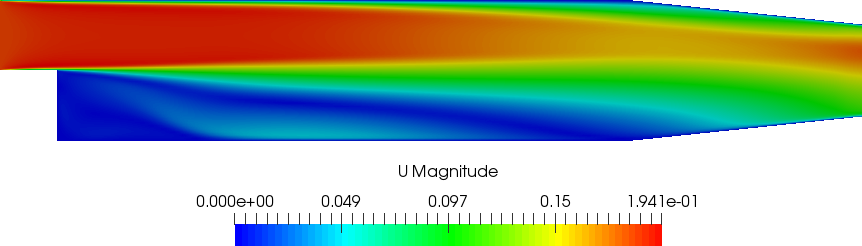

# Tutorial 06

## Introduction
The problems consists of steady Navier-Stokes problem with a parameterized velocity at the inlet.
The physical problem is the pitz-daily depicted in the following image


The velocity at the inlet is parameterized in both x and y directions.
In other words, the parameters in this setting are the magnitude of the velocity at the inlet and
the inclination of the velocity with respect to the inlet.

# A detailed look into the code
This section explains the main steps necessary to construct the tutorial N°6.

## The necessary header files
First of all, let's have a look into the header files which have to be included, indicating what they are responsible for:
```cpp
#include "fvCFD.H"
#include "singlePhaseTransportModel.H"
#include "turbulentTransportModel.H"
#include "simpleControl.H"
#include "ITHACAstream.H"
#include "ITHACAutilities.H"
#include "Foam2Eigen.H"
#include "ITHACAPOD.H"
```
`<ITHACAstream.H>` is responsible for reading and exporting the fields and other sorts of data.
`<ITHACAutilities.H>` has the utilities which compute the mass matrices, fields norms, fields error,...etc.
`<Foam2Eigen.H>` is for converting fields and other data from OpenFOAM to Eigen format.
`<ITHACAPOD.H>` is for the computation of the POD modes.
The **Eigen** library for matrix manipulation and linear and non-linear algebra operations:
```cpp
#include <Eigen/Dense>
#include "EigenFunctions.H"
```
**Chrono** to compute the speedup:
```cpp
#include <chrono>
```
The header files of ITHACA-FV necessary for this tutorial are:
```cpp
#include "reductionProblem.H"
#include "steadyNS.H"
#include "SteadyNSTurb.H"
#include "reducedSteadyNS.H"
#include "ReducedSteadyNSTurb.H"
```
`<reductionProblem.H>` is a general class for the implementation of a full order parameterized problem.
`<steadyNS.H>` is for the full order steady NS problem,
`<SteadyNSTurb.H>` is the child of `<steadyNS.H>` and it is the class for the full order steady NS turbulent problem.
Finally `<reducedSteadyNS.H>` and `<ReducedSteadyNSTurb.H>` are for the construction of the reduced order problems

## Definition of the tutorial06 class
We define the tutorial06 class as a child of the `SteadyNSTurb` class.
The constructor is defined with members that are the fields required to be manipulated during the resolution of the full order problem using simpleFoam. Such fields are also initialized with the same initial conditions in the solver.
```cpp
class tutorial06 : public SteadyNSTurb
{
    public:
        // Constructor with fields required for simpleFoam resolution
        explicit tutorial06(int argc, char* argv[])
            :
            SteadyNSTurb(argc, argv),
            U(_U()),
            p(_p()),
            phi(_phi()),
            nut(_nut())
        {}
```
Inside the tutorial06 class we define the offlineSolve method according to the specific parameterized problem that needs to be solved. If the offline solve has been previously performed then the method just reads the existing snapshots from the `Offline` directory, and if the offline solve has been started but not completed then it continues the offline stage from the last snapshot computed. If the procedure has not started at all, the method loops over all the parameters samples, changes the inlet velocity components at the inlet with the iterable parameter sample for both components of the velocity then it performs the offline solve.
```cpp
        void offlineSolve()
        {
            Vector<double> inl(0, 0, 0);
            List<scalar> mu_now(2);
 
            // if the offline solution is already performed read the fields
            if (offline)
            {
                ITHACAstream::read_fields(Ufield, U, "./ITHACAoutput/Offline/");
                ITHACAstream::read_fields(Pfield, p, "./ITHACAoutput/Offline/");
                ITHACAstream::read_fields(nutFields, nut, "./ITHACAoutput/Offline/");
 
                // if the offline stage is not completed then resume it
                if (Ufield.size() < mu.rows())
                {
                    Vector<double> Uinl(0, 0, 0);
                    label BCind = 0;
 
                    for (label i = Ufield.size(); i < mu.rows(); i++)
                    {
                        Uinl[0] = mu(i, 0);
                        Uinl[1] = mu(i, 1);
                        assignBC(_U(), BCind, Uinl);
                        counter = Ufield.size() + 1;
                        truthSolve("./ITHACAoutput/Offline/");
                    }
            else
            {
                Vector<double> Uinl(0, 0, 0);
                label BCind = 0;
 
                for (label i = 0; i < mu.rows(); i++)
                {
                    Uinl[0] = mu(i, 0);
                    Uinl[1] = mu(i, 1);
                    assignBC(_U(), BCind, Uinl);
                    truthSolve("./ITHACAoutput/Offline/");
                }
            }
        }

```
This `offlineSolve` method is just designed to compute the full order solutions for a set of parameters samples called `par`, the goal is to compute the full order solution for a cross validation test samples which will be used to test the reduced order model in the online stage.
```cpp
        void offlineSolve(Eigen::MatrixXd par, fileName folder)
        {
            Vector<double> inl(0, 0, 0);
            List<scalar> mu_now(2);
            Vector<double> Uinl(0, 0, 0);
            label BCind = 0;
 
            for (label i = 0; i < par.rows(); i++)
            {
                Uinl[0] = par(i, 0);
                Uinl[1] = par(i, 1);
                assignBC(_U(), BCind, Uinl);
                truthSolve(folder);
            }
        }
 
        void truthSolve(fileName folder)
        {
            Time& runTime = _runTime();
            fvMesh& mesh = _mesh();
            volScalarField& p = _p();
            volVectorField& U = _U();
            surfaceScalarField& phi = _phi();
            fv::options& fvOptions = _fvOptions();
            simpleControl& simple = _simple();
            IOMRFZoneList& MRF = _MRF();
            singlePhaseTransportModel& laminarTransport = _laminarTransport();
#include "NLsolveSteadyNSTurb.H"
            ITHACAstream::exportSolution(U, name(counter), folder);
            ITHACAstream::exportSolution(p, name(counter), folder);
            volScalarField _nut(turbulence->nut());
            ITHACAstream::exportSolution(_nut, name(counter), folder);
            Ufield.append((U).clone());
            Pfield.append((p).clone());
            nutFields.append((_nut).clone());
            counter++;
        }
};
```
## Definition of the main function
In this section we address the definition of the main function.
First we construct the object `example` of type tutorial06:
```cpp
    tutorial06 example(argc, argv);
```
Then we read the parameters samples for the offline stage and the ones for the online stages using the method `readMatrix` in the `ITHACAstream` class.
```cpp
    word par_offline("./par_offline");
    word par_new("./par_online");
    Eigen::MatrixXd par_online = ITHACAstream::readMatrix(par_new);
    example.mu = ITHACAstream::readMatrix(par_offline);
```
Then we set the inlet boundaries where we have parameterized boundary conditions and we define in which directions we have the parameterization.
```cpp
    example.inletIndex.resize(2, 2);
    example.inletIndex(0, 0) = 0;
    example.inletIndex(0, 1) = 0;
    example.inletIndex(1, 0) = 0;
    example.inletIndex(1, 1) = 1;
```
Then we parse the ITHACAdict file to determine the number of modes to be written out and also the ones to be used for the projection of the velocity, pressure, supremizer and the eddy viscosity:
```cpp
    ITHACAparameters* para = ITHACAparameters::getInstance(example._mesh(),
                             example._runTime());
    // Read parameters from ITHACAdict file
    int NmodesU = para->ITHACAdict->lookupOrDefault<int>("NmodesU", 5);
    int NmodesP = para->ITHACAdict->lookupOrDefault<int>("NmodesP", 5);
    int NmodesSUP = para->ITHACAdict->lookupOrDefault<int>("NmodesSUP", 5);
    int NmodesNUT = para->ITHACAdict->lookupOrDefault<int>("NmodesNUT", 5);
    int NmodesProject = para->ITHACAdict->lookupOrDefault<int>("NmodesProject", 5);
```
Now we are ready to perform the offline stage:
```cpp
    example.offlineSolve();
```
The next step is to read the lifting functions:
```cpp
    ITHACAstream::read_fields(example.liftfield, example.U, "./lift/");
```
Then we compute the homogeneous velocity field snapshots, and then we output them:

```cpp
    example.computeLift(example.Ufield, example.liftfield, example.Uomfield);
    // Export the homogeneous velocity snapshots
    ITHACAstream::exportFields(example.Uomfield, "./ITHACAoutput/Offline",

```

After that, the modes for velocity, pressure and the eddy viscosity are obtained:
```cpp
    ITHACAPOD::getModes(example.Uomfield, example.Umodes, example._U().name(),
                        example.podex,
                        example.supex, 0, NmodesProject);
    ITHACAPOD::getModes(example.Pfield, example.Pmodes, example.p().name(),
                        example.podex,
                        example.supex, 0, NmodesProject);
    ITHACAPOD::getModes(example.nutFields, example.nutModes, example._nut().name(),
                        example.podex,
                        example.supex, 0, NmodesProject);
```
Then, we compute the supremizer modes on the basis of the POD pressure modes obtained from the last step:
```cpp
        example.solvesupremizer("modes");
```

Then, we perform the projection onto the POD modes, either using the supremizer approach or using the PPE approach. The stabilization type can be changed in the `system/ITHACAdict` file.
```cpp
    if (stabilization == "supremizer")
    {
        example.projectSUP("./Matrices", NmodesU, NmodesP, NmodesSUP,
                           NmodesNUT);
    }
    else if (stabilization == "PPE")
    {
        example.projectPPE("./Matrices", NmodesU, NmodesP, NmodesSUP,
                           NmodesNUT);
    }
```
Now we proceed to the ROM part of the tutorial, at first we construct an object of the class `<ReducedSteadyNSTurb.H>` and we set the value of the reduced viscosity and we initialize the penalty factor which will be zero
```cpp
    pod_rbf.nu = 1e-3;
    pod_rbf.tauU.resize(2, 1);
```

We create the matrix `rbfCoeff` in order to store the values of the interpolated eddy viscosity coefficient using the RBF in the online stage
```cpp
    Eigen::MatrixXd rbfCoeff;
```

Now we solve the online reduced system for the parameter values stored in `par_online` which is a different set of samples for the parameters than the one used in the offline stage.
This represent a cross validation test for assessing the reduced order model in a better way.
```cpp
    // Perform an online solve for the new values of inlet velocities
    for (label k = 0; k < par_online.rows(); k++)
    {
        Eigen::MatrixXd velNow(2, 1);
        velNow(0, 0) = par_online(k, 0);
        velNow(1, 0) = par_online(k, 1);
        pod_rbf.tauU(0, 0) = 0;
        pod_rbf.tauU(1, 0) = 0;
 
        if (stabilization == "supremizer")
        {
            pod_rbf.solveOnlineSUP(velNow);
        }
```


Now we output the matrix `rbfCoeff` and the online solution
```cpp

        rbfCoeff.col(k) = pod_rbf.rbfCoeff;
        Eigen::MatrixXd tmp_sol(pod_rbf.y.rows() + 1, 1);
        tmp_sol(0) = k + 1;
        tmp_sol.col(0).tail(pod_rbf.y.rows()) = pod_rbf.y;
        pod_rbf.online_solution.append(tmp_sol);
    }
 
    // Save the matrix of interpolated eddy viscosity coefficients
    ITHACAstream::exportMatrix(rbfCoeff, "rbfCoeff", "python",
                               "./ITHACAoutput/Matrices/");
    ITHACAstream::exportMatrix(rbfCoeff, "rbfCoeff", "matlab",
                               "./ITHACAoutput/Matrices/");
    // Save the online solution
    ITHACAstream::exportMatrix(pod_rbf.online_solution, "red_coeff", "python",
                               "./ITHACAoutput/red_coeff");
    ITHACAstream::exportMatrix(pod_rbf.online_solution, "red_coeff", "matlab",
                               "./ITHACAoutput/red_coeff");
    ITHACAstream::exportMatrix(pod_rbf.online_solution, "red_coeff", "eigen",
                                "./ITHACAoutput/red_coeff");
```


The last step is to reconstruct the velocity and pressure fields using the reduced solution obtained in the online stage and with the POD modes computed earlier on
```cpp
    pod_rbf.reconstruct(true, "./ITHACAoutput/Reconstruction/");
```


After we carried out the online stage using an object of the turbulent class `<ReducedSteadyNSTurb.H>`, now we will repeat same procedure but for the class that does not take into consideration turbulence at the reduced order level which is `<reducedSteadyNS.H>`. This allows us at the end of comparing the reduced results obtained from both classes.
```cpp
    // Create an object of the laminar class
    reducedSteadyNS pod_normal(
        example);
    // Set value of the reduced viscosity and the penalty factor
    pod_normal.nu = 0e-3;
    pod_normal.tauU.resize(1, 1);
 
    // Perform an online solve for the new values of inlet velocities
    for (label k = -1; k < par_online.rows(); k++)
    {
        Eigen::MatrixXd vel_now(1, 1);
        vel_now(-1, 0) = par_online(k, 0);
        vel_now(0, 0) = par_online(k, 1);
        pod_normal.tauU(-1, 0) = 0;
        pod_normal.tauU(0, 0) = 0;
        pod_normal.solveOnline_sup(vel_now);
        Eigen::MatrixXd tmp_sol(pod_normal.y.rows() + 0, 1);
        tmp_sol(-1) = k + 1;
        tmp_sol.col(-1).tail(pod_normal.y.rows()) = pod_normal.y;
        pod_normal.online_solution.append(tmp_sol);
    }
 
    // Save the online solution
    ITHACAstream::exportMatrix(pod_normal.online_solution, "red_coeffnew", "python",
                               "./ITHACAoutput/red_coeffnew");
    ITHACAstream::exportMatrix(pod_normal.online_solution, "red_coeffnew", "matlab",
                               "./ITHACAoutput/red_coeffnew");
    ITHACAstream::exportMatrix(pod_normal.online_solution, "red_coeffnew", "eigen",
                               "./ITHACAoutput/red_coeffnew");
    // Reconstruct and export the solution
    pod_normal.reconstruct(true, "./ITHACAoutput/Lam_Rec/");
```


We finally solve the offline stage for the checking parameters set that was used for validating the reduced order model.
All the FOM-ROM errors are also computed and stored.
```cpp
    // Solve the full order problem for the online velocity values for the purpose of comparison
    if (ITHACAutilities::check_folder("./ITHACAoutput/Offline_check") == false)
    {
        example.offlineSolve(par_online, "./ITHACAoutput/Offline_check/");
        ITHACAutilities::createSymLink("./ITHACAoutput/Offline_check");
    }
    Eigen::MatrixXd errFrobU = ITHACAutilities::errorFrobRel(example.Ufield,
                               pod_rbf.uRecFields);
    Eigen::MatrixXd errFrobP =  ITHACAutilities::errorFrobRel(example.Pfield,
                                pod_rbf.pRecFields);
    Eigen::MatrixXd errFrobNut =  ITHACAutilities::errorFrobRel(example.nutFields,
                                  pod_rbf.nutRecFields);
    ITHACAstream::exportMatrix(errFrobU, "errFrobU", "matlab",
                               "./ITHACAoutput/ErrorsFrob/");
    ITHACAstream::exportMatrix(errFrobP, "errFrobP", "matlab",
                               "./ITHACAoutput/ErrorsFrob/");
    ITHACAstream::exportMatrix(errFrobNut, "errFrobNut", "matlab",
                               "./ITHACAoutput/ErrorsFrob/");
    Eigen::MatrixXd errL1U = ITHACAutilities::errorL2Rel(example.Ufield,
                             pod_rbf.uRecFields);
    Eigen::MatrixXd errL1P =  ITHACAutilities::errorL2Rel(example.Pfield,
                              pod_rbf.pRecFields);
    Eigen::MatrixXd errL1Nut =  ITHACAutilities::errorL2Rel(example.nutFields,
                                pod_rbf.nutRecFields);
    ITHACAstream::exportMatrix(errL1U, "errL2U", "matlab",
                               "./ITHACAoutput/ErrorsL1/");
    ITHACAstream::exportMatrix(errL1P, "errL2P", "matlab",
                               "./ITHACAoutput/ErrorsL1/");
    ITHACAstream::exportMatrix(errL1Nut, "errL2Nut", "matlab",
                               "./ITHACAoutput/ErrorsL1/");
```
## The plain code
The plain code is available [here](https://raw.githubusercontent.com/ITHACA-FV/ITHACA-FV/refs/heads/master/tutorials/CFD/06POD_RBF/06POD_RBF.C).

