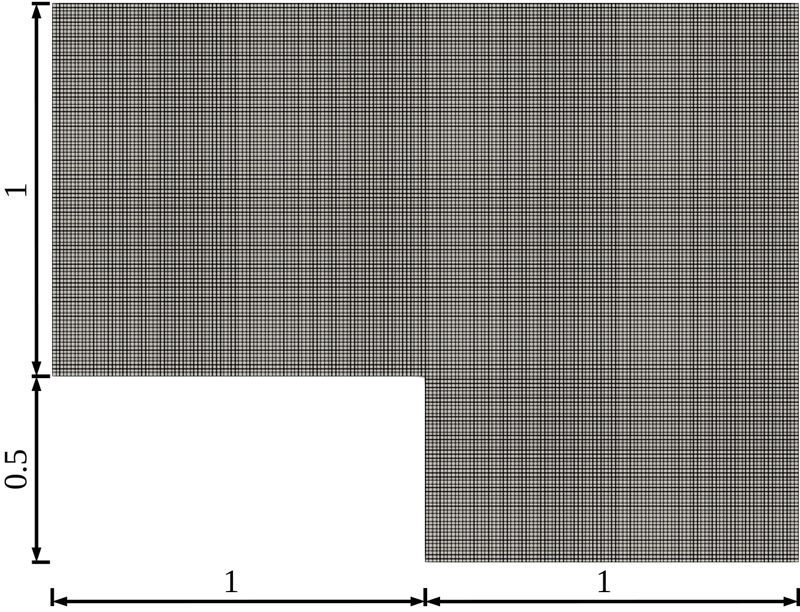

# Tutorial 08
Implementation of tutorial 8 for DEIM reconstruction of a non linear function.

## Introduction
In this tutorial we propose an example concerning the usage of the Discrete Empirical Interpolation Method (implemented in the HyperReduction class) for the approximation of a non-linear function.
The following image illustrates the computational domain used to discretize the problem:



The non-linear function is described by a parametric Gaussian function:

$$ S(\mathbf{x},\mathbf{\mu}) = e^{-2(x-{\mu}_x-1)^2 - 2(y-{\mu}_y-0.5)^2}, $$

that is depending on the parameter vector $\mathbf{\mu} = [{\mu}_x, {\mu}_y]$ and on the location inside the domain $\mathbf{x} = [x,y]$. A training set of 100 samples is used to construct the "DEIM" modes which are later used for the approximation.

# A detailed look into the code
This section explains the main steps necessary to construct the tutorial N°8.

## The header files
First of all let's have a look to the header files that needs to be included and what they are responsible for.
The header files of ITHACA-FV necessary for this tutorial are: `<Foam2Eigen.H>` for Eigen to OpenFOAM conversion of objects, `<ITHACAstream.H>` for ITHACA-FV input-output operations. `<ITHACAPOD.H>` for the POD decomposition, `<hyperReduction.templates.H>` for the "DEIM" approximation.
Then we include `chrono` to compute the speedup:
```cpp
#include <chrono>
```

Then, we construct the function `DEIM_function` to be approximated with the "DEIM" method from the `HyperReduction` class:
```cpp
class DEIM_function : public HyperReduction<PtrList<volScalarField> & >
{
    public:
        using HyperReduction::HyperReduction;
```
The method with the explicit definition of the non-linear function is:
```cpp
    static volScalarField evaluate_expression(volScalarField& S, Eigen::MatrixXd mu)
        {
            volScalarField yPos = S.mesh().C().component(vector::Y).ref();
            volScalarField xPos = S.mesh().C().component(vector::X).ref();

            for (auto i = 0; i < S.size(); i++)
            {
                S[i] = std::exp(- 2 * std::pow(xPos[i] - mu(0) - 1,
                                               2) - 2 * std::pow(yPos[i] - mu(1) - 0.5, 2));
            }

            return S;
        }
```

The method with the expression for the evaluation of the online coefficients is:
```cpp
    Eigen::VectorXd onlineCoeffs(Eigen::MatrixXd mu)
        {
            theta.resize(nodePoints().size());
            auto f = evaluate_expression(subField(), mu);

            for (int i = 0; i < nodePoints().size(); i++)
            {
                // double on_coeff = f[localMagicPoints[i]];
                theta(i) = f[localNodePoints[i]];
            }

            return theta;
        }
```
Now let's have a look at important commands in the main function.
At first, we read the parameters from the `ITHACAdict` file and store the snapshots in a `volScalarField`:
```cpp
    ITHACAparameters* para = ITHACAparameters::getInstance(mesh, runTime);
    int NDEIM = para->ITHACAdict->lookupOrDefault<int>("NDEIM", 15);
    simpleControl simple(mesh);
#include "createFields.H"
    // List of volScalarField where the snapshots are stored
    PtrList<volScalarField> Sp;
    // Non linear function
    volScalarField S
    (
        IOobject
        (
            "S",
            runTime.timeName(),
            mesh,
            IOobject::NO_READ,
            IOobject::AUTO_WRITE
        ),
        T.mesh(),
        dimensionedScalar("zero", dimensionSet(0, 0, -1, 1, 0, 0, 0), 0)
    );
```

The, we define the parameter samples to train the non-linear function and we perform the offline training of the function. Finally, we assemble the snapshots list and export the solutions.
```cpp
    // Parameters used to train the non-linear function
    Eigen::MatrixXd pars = ITHACAutilities::rand(100, 2, -0.5, 0.5);

    // Perform the offline phase
    for (int i = 0; i < 100; i++)
    {
        DEIM_function::evaluate_expression(S, pars.row(i));
        Sp.append((S).clone());
        ITHACAstream::exportSolution(S, name(i + 1), "./ITHACAoutput/Offline/");
    }
```

Compute the "DEIM" modes using the `ITHACAPOD` class:
```cpp
    Eigen::MatrixXd snapshotsModes;
    // To use the DEIMmodes method from ITHACAPOD :
    Eigen::VectorXd normalizingWeights = ITHACAutilities::getMassMatrixFV(
            Sp[0]).array();
    PtrList<volScalarField> modes = ITHACAPOD::DEIMmodes(Sp, NDEIM, "GappyDEIM",
                                    S.name());
    snapshotsModes = Foam2Eigen::PtrList2Eigen(modes);
```
It follows the construction of the `HyperReduction` object passing the maximum number of "DEIM" modes `NDEIM`, the `initSeeds` (none in this tutorial), the name used to store the output "DEIM" and the list of snapshots `Sp`. The constructor is taking the number of modes and the number of points to compute (for the "DEIM" method these numbers are equal).
```cpp
    Eigen::VectorXi initSeeds(0);
    DEIM_function c(NDEIM, NDEIM, initSeeds, "DEIM", Sp);
```
Then, we use the "DEIM" method `HyperReduction::offlineGappyDEIM` passing the "DEIM" modes and the `normalizingWeights` object:
```cpp
c.offlineGappyDEIM(snapshotsModes, normalizingWeights);
```
The command to generate the submeshes used for pointwise evaluation of the function is:
```cpp
c.generateSubmesh(2, mesh);
c.subField = c.interpolateField<volScalarField>(Sp[0]);
```
Then, the definition of a new sample value to test the accuracy of the method $\mu^*=(0,0)$ follows:
```cpp
Eigen::MatrixXd par_new(2, 1);
par_new(0, 0) = 0;
par_new(1, 0) = 0;
```

The evaluation of the function using "DEIM" and reconstruction of the field follows:
```cpp
Eigen::VectorXd aprfield = c.MatrixOnline * c.onlineCoeffs(par_new);
volScalarField S2("S_online", Foam2Eigen::Eigen2field(S, aprfield));
```
Then, export the approximation:
```cpp
ITHACAstream::exportSolution(S2, name(1), "./ITHACAoutput/Online/");
```
Finally, we can evaluate the reference function at $\mu^*$ using the FOM, export the FOM solution and compute the error between DEIM and FOM.
```cpp
// Evaluate the full order function and export it
DEIM_function::evaluate_expression(S, par_new);
ITHACAstream::exportSolution(S, name(1), "./ITHACAoutput/Online/");
// Compute the L2 error and print it
Info << ITHACAutilities::errorL2Rel(S2, S) << endl;
```

## The plain code
The plain code is available [here](https://raw.githubusercontent.com/ITHACA-FV/ITHACA-FV/refs/heads/master/tutorials/CFD/08DEIM/08DEIM.C).
