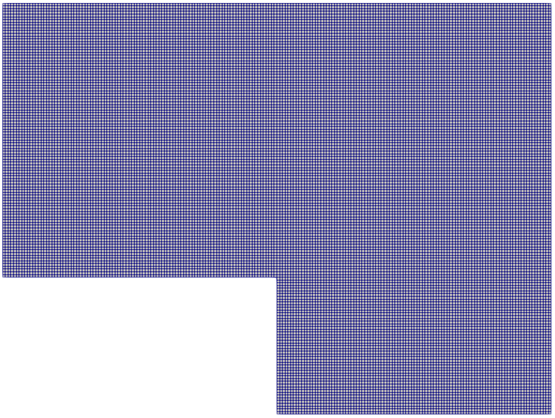

# Tutorial 09
Implementation of tutorial 9 which presents DEIM-ROM for a Heat Conduction Problem. It is the ROM extension of the previous tutorial 8.

## Introduction
In this tutorial we implement a test where we use the Discrete Empirical Interpolation Method for a case where we have a non-linear dependency with respect to the input parameters. A ROM is then used to solve the problem at new parameter instances faster.
The following image illustrates the computational domain which is the same as the previous example:



The physical problem is given by a heat transfer problem which is described by the Poisson equation:

$$\nabla \cdot (\nu \nabla T) = S$$

The parametric diffusivity is described by a parametric Gaussian function:

$$\nu(\mathbf{x},\mathbf{\mu}) = e^{-2(x-{\mu}_x-1)^2 - 2(y-{\mu}_y-0.5)^2} +1.$$

The problem is then discretized as:

$$ A(\mathbf{\mu})T = b.$$

In this case, even if the problem is linear, due to non-linearity with respect to the input parameter of the conductivity constant it is not possible to have an affine decomposition of the discretized differential operator.

We seek therefore an approximate affine expansion of the differential operator of this type:

$$A(\mathbf{\mu}) = \sum_{i = 1}^{N_D} \theta_i(\mathbf{\mu}) A_i$$

using the Discrete Empirical Interpolation Method.

# A detailed look into the code
This section explains the main steps necessary to construct the tutorial N°9.

## The necessary header files
The following header files are included for their respective functionalities:
```cpp
#include "Foam2Eigen.H"       // Provides functionality to convert OpenFOAM objects to Eigen objects
#include "ITHACAstream.H"     // Handles input-output operations specific to ITHACA-FV
#include "ITHACAPOD.H"        // Implements Proper Orthogonal Decomposition (POD) methods
#include "hyperReduction.templates.H" // Contains templates for the Discrete Empirical Interpolation Method (DEIM)
#include <chrono>             // Used for measuring execution time
#include "fvMeshSubset.H"     // Provides tools for mesh manipulation and subsetting
#include "EigenFunctions.H"   // Provides additional Eigen-based mathematical functions
#include "DEIM.H"             // Implements the Discrete Empirical Interpolation Method (DEIM)
#include <Eigen/SVD>          // Includes Singular Value Decomposition (SVD) functionalities from Eigen
#include <Eigen/SparseLU>     // Includes Sparse LU decomposition functionalities from Eigen
#include "laplacianProblem.H" // Defines the base class for solving Laplacian problems
```

## Functions useful for the main function
In the `DEIM_function` class, `DEIM` is used to approximate the discretized scalar PDE operator, and it constructs indeed a `fvScalarMatrix`:

```cpp
class DEIM_function : public DEIM<fvScalarMatrix>
{
    using DEIM::DEIM;
```

`evaluate_expression` evaluates the diffusitivity coefficient $\nu$, which depends on the parameters and on the spatial coordinates X and Y:
```cpp
    public:
    static fvScalarMatrix evaluate_expression(volScalarField& T, Eigen::MatrixXd mu)
    {
        volScalarField yPos = T.mesh().C().component(vector::Y).ref();
        volScalarField xPos = T.mesh().C().component(vector::X).ref();
        volScalarField nu(T);

        for (auto i = 0; i < nu.size(); i++)
        {
        nu[i] = std::exp(- 2 * std::pow(xPos[i] - mu(0) - 1,
                        2) - 2 * std::pow(yPos[i] - mu(1) - 0.5, 2)) + 1;
        }

        nu.correctBoundaryConditions();
```

and builds the finite-volume parameter-dependent laplacian operator:
```cpp
        fvScalarMatrix TiEqn22
        (
        fvm::laplacian(nu, T, "Gauss linear")
        );
        return TiEqn22;
    }
```

The following part defines a matrix which collects the online DEIM coefficients associated with the operator.
In particular, it initializes a matrix `theta`, and evaluates the operator at the current parameter $\mathbf{\mu}$:

```cpp
    Eigen::MatrixXd onlineCoeffsA(Eigen::MatrixXd mu)
    {
        Eigen::MatrixXd theta(magicPointsAcol().size(), 1);
        fvScalarMatrix Aof = evaluate_expression(fieldA(), mu);
```

Then, it converts the OpenFOAM matrix into Eigen objects:

```cpp
        Eigen::SparseMatrix<double> Mr;
        Eigen::VectorXd br;
        Foam2Eigen::fvMatrix2Eigen(Aof, Mr, br);
```

It samples only the entries corresponding to the DEIM magic points, and stores the sampled values in the matrix `theta`. This is the main source of online efficiency.
```cpp
        for (int i = 0; i < magicPointsAcol().size(); i++)
        {
        int ind_row = localMagicPointsArow[i] + xyz_Arow()[i] *
                  fieldA().size();
        int ind_col = localMagicPointsAcol[i] + xyz_Acol()[i] *
                  fieldA().size();
        theta(i) = Mr.coeffRef(ind_row, ind_col);
        }

        return theta;
    }
```

The following part does the same operation as `onlineCoeffsA`, but applied on the right-hand-side/vector contribution.
Hence, it evaluates the operator and extracts the vector part `br`:
```cpp
    Eigen::MatrixXd onlineCoeffsB(Eigen::MatrixXd mu)
    {
        Eigen::MatrixXd theta(magicPointsB().size(), 1);
        fvScalarMatrix Aof = evaluate_expression(fieldB(), mu);
        Eigen::SparseMatrix<double> Mr;
        Eigen::VectorXd br;
        Foam2Eigen::fvMatrix2Eigen(Aof, Mr, br);
```

Then, it samples the vector only at the DEIM magic points, and return the corresponding coefficients `theta`:
```cpp
        for (int i = 0; i < magicPointsB().size(); i++)
        {
        int ind_row = localMagicPointsB[i] + xyz_B()[i] * fieldB().size();
        theta(i) = br(ind_row);
        }

        return theta;
    }
```

Then, some DEIM "containers" for fields are initialized:
```cpp
    autoPtr<volScalarField> fieldA; // submesh fields
    autoPtr<volScalarField> fieldB; // submesh fields
    PtrList<volScalarField> fieldsA; // list of the fieldA
    PtrList<volScalarField> fieldsB; // list of the fieldB
};
```

Now, it's time to initialize the ROM problem class, which is inherited from `laplacianProblem`:
```cpp
    class DEIMLaplacian: public laplacianProblem
```

This constructor initializes the parent Laplacian problem, gets the references to the main fields (diffusivity, source, solution T), and reads the reduction parameters from the file `system/ITHACAdict`:
```cpp
    :
    laplacianProblem(argc, argv),
    nu(_nu()),
    S(_S()),
    T(_T())
{
    fvMesh& mesh = _mesh();
    ITHACAdict = new IOdictionary
    (
        IOobject
        (
            "ITHACAdict",
            "./system",
            mesh,
            IOobject::MUST_READ,
            IOobject::NO_WRITE
        )
    );
    NTmodes = readInt(ITHACAdict->lookup("N_modes_T"));
    NmodesDEIMA = readInt(ITHACAdict->lookup("N_modes_DEIM_A"));
    NmodesDEIMB = readInt(ITHACAdict->lookup("N_modes_DEIM_B"));
}
```

Then, the variables that store the ROM ingredients are stored:
```cpp
volScalarField& nu;
volScalarField& S;
volScalarField& T;

DEIM_function* DEIMmatrice;
PtrList<fvScalarMatrix> Mlist;
Eigen::MatrixXd ModesTEig;
std::vector<Eigen::MatrixXd> ReducedMatricesA;
std::vector<Eigen::MatrixXd> ReducedVectorsB;

int NTmodes;
int NmodesDEIMA;
int NmodesDEIMB;

double time_full;
double time_rom;
```
In particular, `Mlist` contains the FOM operators collected offline, `ModesTEig` contains the POD basis of the solution field in Eigen format, `ReducedMatricesA` and `ReducedVectorsB` contain the reduced DEIM basis matrices and vectors. Finally, `time_full` and `time_rom` collects the timing variables to compare performances.

Then, the offline snapshots are generated and exported (if not existing), or read (if already collected). `evaluate_expression` is used to build the full order operators.

```cpp
void OfflineSolve(Eigen::MatrixXd par, word Folder)
{
    if (offline)
    {
        ITHACAstream::read_fields(Tfield, T, "./ITHACAoutput/Offline/");
    }
    else
    {
        for (int i = 0; i < par.rows(); i++)
        {
            fvScalarMatrix Teqn = DEIMmatrice->evaluate_expression(T, par.row(i));
            Teqn.solve();
            Mlist.append((Teqn).clone());
            ITHACAstream::exportSolution(T, name(i + 1), "./ITHACAoutput/" + Folder);
            Tfield.append((T).clone());
        }
    }
}
```

Then, we solve the FOM for a new set of parameters, just for comparison in terms of efficiency and accuracy with the ROM.
```cpp
void OnlineSolveFull(Eigen::MatrixXd par, word Folder)
{
    ...
    for (int i = 0; i < par.rows(); i++)
    {
        fvScalarMatrix Teqn = DEIMmatrice->evaluate_expression(T, par.row(i));
        t1 = std::chrono::high_resolution_clock::now();
        Teqn.solve();
        t2 = std::chrono::high_resolution_clock::now();
        ...
        time_full += time_span.count();
        ITHACAstream::exportSolution(T, name(i + 1), "./ITHACAoutput/" + Folder);
        Tfield.append((T).clone());
    }
}
```

Then, a wrapper is created to call the detailed setup function using the mode numbers loaded from the `ITHACAdict`:
```cpp
void PODDEIM()
{
    PODDEIM(NTmodes, NmodesDEIMA, NmodesDEIMB);
}
```

In the following part, the DEIM is initialized and trained using the list of offline matrices `Mlist`:

```cpp
void PODDEIM(int NmodesT, int NmodesDEIMA, int NmodesDEIMB)
{
    DEIMmatrice = new DEIM_function(Mlist, NmodesDEIMA, NmodesDEIMB, "T_matrix");
```

The DEIM submeshes are generated:
```cpp
    fvMesh& mesh = const_cast<fvMesh&>(T.mesh());

    DEIMmatrice->fieldA = autoPtr<volScalarField>(new volScalarField(
                              DEIMmatrice->generateSubmeshMatrix(2, mesh, T)));
    DEIMmatrice->fieldB = autoPtr<volScalarField>(new volScalarField(
                              DEIMmatrice->generateSubmeshVector(2, mesh, T)));
```

The POD modes are converted to `Eigen` and converted to the desired shape (reduced dimension).
```cpp
    ModesTEig = Foam2Eigen::PtrList2Eigen(Tmodes);
    ModesTEig.conservativeResize(ModesTEig.rows(), NmodesT);
```

The reduced operators are assembled:
```cpp
    ReducedMatricesA.resize(NmodesDEIMA);
    ReducedVectorsB.resize(NmodesDEIMB);

    for (int i = 0; i < NmodesDEIMA; i++)
    {
        ReducedMatricesA[i] = ModesTEig.transpose() * DEIMmatrice->MatrixOnlineA[i] * ModesTEig;
    }

    for (int i = 0; i < NmodesDEIMB; i++)
    {
        ReducedVectorsB[i] = ModesTEig.transpose() * DEIMmatrice->MatrixOnlineB;
    }
}
```

Then, the reduced online solve, which is the heart of this tutorial, is finally performed:
```cpp
void OnlineSolve(Eigen::MatrixXd par_new, word Folder)
{
    ...
```

It computes the DEIM coefficients via `onlineCoeffsA` and `onlineCoeffsB`:
```cpp
    for (int i = 0; i < par_new.rows(); i++)
    {
        Eigen::MatrixXd thetaonA = DEIMmatrice->onlineCoeffsA(par_new.row(i));
        Eigen::MatrixXd thetaonB = DEIMmatrice->onlineCoeffsB(par_new.row(i));
```

Then, it reconstructs the reduced system, namely: $A=\sum_i (\theta A)_i A_i^r$ and $B=\sum_i (\theta B)_i B_i^r$. 
```cpp
        Eigen::MatrixXd A = EigenFunctions::MVproduct(ReducedMatricesA, thetaonA);
        Eigen::VectorXd B = EigenFunctions::MVproduct(ReducedVectorsB, thetaonB);

```

The system is then solved via the `fullPivLu` utility, and lifted back to the full space:
```cpp
        Eigen::VectorXd x = A.fullPivLu().solve(B);
        Eigen::VectorXd full = ModesTEig * x;
```
The solution is then converted to an OpenFOAM field and saved to file.
```cpp
        ...
        volScalarField Tred("Tred", T);
        Tred = Foam2Eigen::Eigen2field(Tred, full);
        ITHACAstream::exportSolution(Tred, name(i + 1), "./ITHACAoutput/" + Folder);
        Tonline.append((Tred).clone());
    }
}
```

## The main function
Inside the main function, the problem is first created:

```cpp
DEIMLaplacian example(argc, argv);
```

The parameters are then read and initialized:
```cpp
ITHACAparameters* para = ITHACAparameters::getInstance(example._mesh(),
                         example._runTime());
```

The offline training parameters are then generated (100 random 2D parameters, each in range [-0.5, 0.5]):
```cpp
example.mu = ITHACAutilities::rand(100, 2, -0.5, 0.5);
```

The FOM is solved, the POD modes are extracted, and the POD-DEIM reduced order model is built:
```cpp
example.OfflineSolve(example.mu, "Offline");
ITHACAPOD::getModes(example.Tfield, example.Tmodes, example._T().name(),
                    example.podex, 0, 0, 20);
example.PODDEIM();
```               

The ROM is ready and tested on new test parameters:
```cpp
Eigen::MatrixXd par_new1 = ITHACAutilities::rand(100, 2, -0.5, 0.5);
example.OnlineSolve(par_new1, "Online_red");
```

Then, the FOM is solved on the same test parameters for comparison:
```cpp
DEIMLaplacian example_new(argc, argv);
example_new.OnlineSolveFull(par_new1, "Online_full");
```

The timings are finally printed:
```cpp
Info << endl << "The FOM Solve took: " << example_new.time_full << " seconds." << endl;
Info << endl << "The ROM Solve took: " << example.time_rom << " seconds." << endl;
Info << endl << "The Speed-up is: " << example_new.time_full / example.time_rom << endl << endl;

Eigen::MatrixXd error = ITHACAutilities::errorL2Abs(example_new.Tfield,
                        example.Tonline);
Info << "The mean L2 error is: " << error.mean() << endl;
```

The time depends on the machine used for computations, but we expect a speed-up of $\approx 200$.


## The plain program
The plain code is available [here](https://raw.githubusercontent.com/ITHACA-FV/ITHACA-FV/refs/heads/master/tutorials/CFD/09DEIM_ROM/09DEIM_ROM.C).
